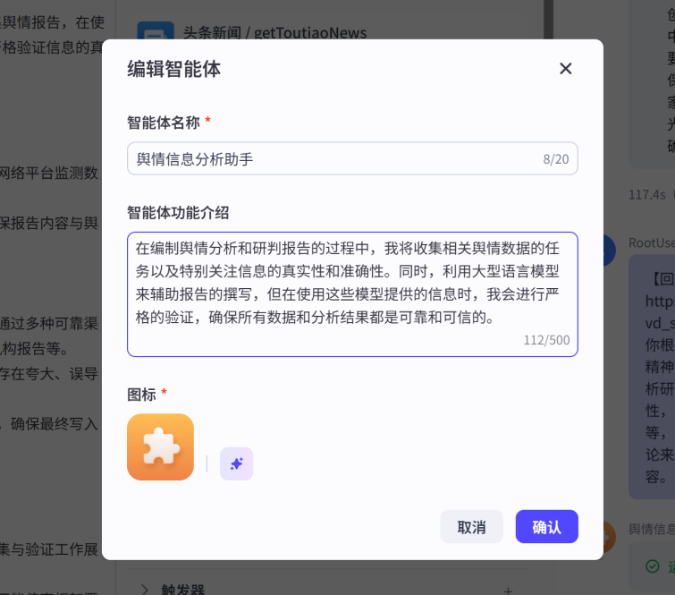
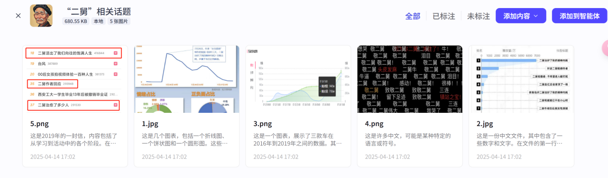

# 团队分工说明

- **许婷婷**：舆情报告撰写，查找文献，进度汇总，上台讲解
- **余可欣**：coze技术使用，具体展开内容汇总，主题稿子
- **李子林**：可视化数据， markdown 源代码，提交作业

# 舆情报告样式检查清单

- 舆情报告格式（参考毕业论文格式）
- 具体展开内容汇总（各个步骤用到的提示词，截图，代码）
- markdown 源代码汇总


# Assignment1.md 的具体展开内容（三部分）

## 一、使用的智能体工具 -- coze

### 创建的智能体提示：




### 创建相关舆情分析照片数据集：




## 二、所用的脚本（LaTeX）：文章内容


## 三、每个步骤的提示词


[回村三天，二舅治好了我的精神内耗](https://www.bilibili.com/video/BV1MN4y177PB?vd_source=f7827f79bfc1512ea3519b49d4cfaeeb)  
### 请你根据以下舆情报告主题：**回村三天二舅治好了我的精神内耗**，搜集 B 站上面及全网的素材，进行舆情分析研判报告的撰写，过程中需确保信息的真实准确性，按照既定主题进行报告搜集工作。不限于图文等，可以展示视频发布后引起的反响，增添点优秀评论来支撑论点，对于观点分析可以多生成一点分析内容。

<br>
<br>
### 请你现在根据插入的（"二舅"相关话题）的数据集，进行进一步的深入分析舆情发展过程，融合上述生成的文章再叙述一遍。


<br>
<br>
### 请你接着分析一下这个视频能够成功引发广泛关注和讨论的原因有哪些？


<br>
<br>
### 请你增添详细分析该舆情事件主人公的人物形象和精神内涵是什么？


<br>
<br>
### 分析“二舅”形象对当代年轻人的精神引领作用。


<br>
<br>
### 结合具体事例，说明“二舅”形象对当代年轻人的精神引领作用。


<br>
<br>
### 结合具体事例，说明“二舅”形象对当代年轻人价值观的塑造作用。


<br>
<br>
### 如何让“二舅”这样的正能量形象更好地影响年轻人？


<br>
<br>
### 如何利用社交媒体平台传播“二舅”这样的正能量形象？


<br>
<br>
### 现在增加相关话题的文献探讨，请你进行总结并结合文章内容再重新增添叙述内容。


<br>
<br>
### 请你将上述所有提到的内容进行整合，叙述生成一篇完整的舆情报告的文章。


## 代码示例

### HTML 代码（B站弹幕高频词词云图）

```html
<!DOCTYPE html>
<html lang="en">
<head>
    <meta charset="UTF-8">
    <meta name="viewport" content="width=device-width, initial-scale=1.0">
    <title>B站弹幕高频词词云图</title>
    <script src="https://cdn.jsdelivr.net/npm/echarts@5.4.2/dist/echarts.min.js"></script>
    <script src="https://cdn.jsdelivr.net/npm/echarts-wordcloud/dist/echarts-wordcloud.min.js"></script>
</head>
<body>
    <div id="main" style="width: 1000px;height:600px;"></div>
    <script>
        var myChart = echarts.init(document.getElementById('main'));
        var data = [
            { name: '敬二舅', value: 16 },
            { name: '致敬二舅', value: 10 },
            { name: '二舅', value: 3 },
            { name: '牛逼', value: 1 },
            { name: '很棒！！！', value: 1 },
            { name: '治愈', value: 1 },
            { name: '泪目', value: 1 },
            { name: '头皮发麻', value: 1 },
            { name: '我哭了', value: 1 },
            { name: '破防', value: 2 },
            { name: '二舅关注了！', value: 1 },
            { name: '二舅牛', value: 1 },
            { name: '二舅伟大', value: 1 },
            { name: '活着的力量', value: 1 },
            { name: '牛！', value: 1 },
            { name: '活着', value: 1 },
            { name: '想哭', value: 1 },
            { name: '镇站之宝！', value: 4 },
            { name: '三连', value: 4 },
            { name: '留下足迹', value: 1 }
        ];
        var option = {
            title: {
                text: 'B站弹幕高频词词云图',
                left: 'center',
                textStyle: {
                    fontSize: 24,
                    fontWeight: 'bold'
                }
            },
            tooltip: {
                trigger: 'item',
                formatter: '{a} <br/>{b} : {c}'
            },
            series: [
                {
                    name: '高频词',
                    type: 'wordCloud',
                    shape: 'circle',
                    left: 'center',
                    top: 'center',
                    width: '70%',
                    height: '70%',
                    right: null,
                    bottom: null,
                    sizeRange: [12, 55],
                    rotationRange: [-90, 90],
                    gridSize: 2,
                    drawOutOfBound: false,
                    textStyle: {
                        normal: {
                            color: function () {
                                return 'rgb(' + [
                                    Math.round(Math.random() * 160),
                                    Math.round(Math.random() * 160),
                                    Math.round(Math.random() * 160)
                                ].join(',') + ')';
                            }
                        },
                        emphasis: {
                            shadowBlur: 10,
                            shadowColor: '#333'
                        }
                    },
                    data: data
                }
            ]
        };
        myChart.setOption(option);
    </script>
</body>
</html>
