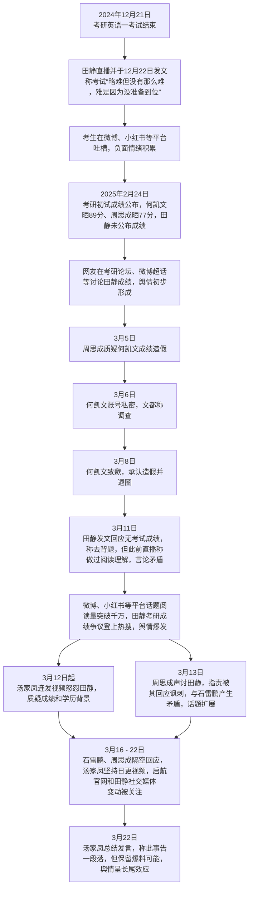

# 关于考研英语田静舆情事件

## 摘要

本报告聚焦2025年考研英语田静舆情事件，深入剖析其缘起、发展、影响及背后反映的教育行业问题。

2024年底，田静参与研究生入学英语考试“英语一”，但在成绩公布阶段，以“未答题、仅看题”为由拒绝公布成绩，与其他迅速晒分的同行形成鲜明对比，这一异常举动瞬间引发网友对其真实成绩的强烈好奇与猜测。加之此前2024年12月21日考研英语一考试刚结束，田静就直播并发文称考试“略难但没有那么难，难是因为没准备到位”，这一言论与考生在考场的艰难体验严重相悖，早已在考生群体中积累了负面情绪。此时成绩争议的出现，如同导火索，将此前积累的负面情绪彻底引爆，舆情由此拉开序幕。

随着事件的发展，众多关键人物纷纷介入，使得舆情不断发酵升级。考研数学辅导老师汤家凤直言，只要报名并进入考场，便不存在没有成绩之说，0分也是成绩，他持续发声，指责田静作为教育从业者应具备最起码的诚信。另一位考研英语老师周思成也发布动态声讨田静，认为田静在回应考研分数争议的声明中，“已读、不熟、勿cue”以及“把我追求真实情况的行为说成‘争夺流量’”等表达是在讽刺自己，双方的矛盾进一步激化了舆情。在舆论压力下，田静悄然删除社交平台上的“北京外国语大学”毕业院校信息，这一行为更是加剧了公众的质疑，使得舆情热度居高不下。

此次舆情事件影响深远，不仅对田静个人的声誉与职业发展造成了严重冲击，还引发了公众对整个考研培训行业的信任危机。事件背后，深刻反映出教育行业长期存在的诸多问题。部分教育机构过度依赖“造神式营销”，极力打造名师光环，却忽视了对教师真实教学能力与诚信品质的培养和监督。在这种背景下，“名师效应”被过度放大，教师的成绩、学历等成为吸引生源的核心卖点，而一旦名师人设崩塌，机构信誉与学生信任将遭受重创。同时，行业内部竞争激烈，同行之间缺乏良性互动，为了争夺流量和生源，甚至出现恶意竞争的现象，严重扰乱了教育行业的正常秩序。此外，消费者在选择教育服务时，存在盲目迷信名师的倾向，往往忽视了自身实际需求和教育服务的本质，这也在一定程度上助长了行业乱象。

面对此次舆情事件，教育行业应深刻反思，积极采取措施加以整改。一方面，要建立健全严格的教师资质审核与监督机制，加强对教师教学能力、职业素养和诚信品质的考核，从源头上保障教育服务质量。另一方面，教育机构应摒弃过度商业化的营销模式，回归教育本质，注重提升教学质量和服务水平，以实际教学成果赢得学生和家长的信任。同时，消费者也需要保持理性，树立正确的教育消费观念，不再盲目追捧名师，而是根据自身实际情况选择合适的教育服务。只有多方共同努力，才能重塑教育行业的良好生态，推动教育行业健康、可持续发展。

**关键词**：田静舆情事件、考研英语、成绩争议、教育行业问题

## 目录
- [引言](#引言)
- [事件来源](#事件来源)
  - [2.1 传播频道](#21-传播频道)
  - [2.2 传播内容](#22-传播内容)
- [舆情传播过程](#舆情传播过程)
  - [3.1 考试结束后：不当言论引发负面情绪积累](#31-考试结束后不当言论引发负面情绪积累)
  - [3.2 成绩公布后：成绩未晒引发猜测，舆情初步形成](#32-成绩公布后成绩未晒引发猜测舆情初步形成)
  - [3.3 同行质疑与回应阶段：矛盾升级，舆情爆发](#33-同行质疑与回应阶段矛盾升级舆情爆发)
  - [3.4 多方介入，持续发酵：舆情走向高潮](#34-多方介入持续发酵舆情走向高潮)
  - [3.5 后续余波：舆情长尾持续](#35-后续余波舆情长尾持续)
- [舆情分析](#舆情分析)
  - [4.1 传播平台分析](#41-传播平台分析)
  - [4.2 情感倾向分析](#42-情感倾向分析)
  - [4.3 舆情发展趋势分析](#43-舆情发展趋势分析)
- [舆情应对建议](#舆情应对建议)
  - [5.1 田静个人层面](#51-田静个人层面)
  - [5.2 启航教育机构层面](#52-启航教育机构层面)
  - [5.3 教育行业层面](#53-教育行业层面)
- [结论](#结论)
- [附录](#附录)

## 引言
在教育资源日益成为社会焦点的当下，考研培训行业作为学历进阶的重要辅助力量，其一举一动都牵动着万千学子与家长的心。考研名师凭借专业知识与教学经验，在学生备考过程中扮演着关键角色，也因此被置于公众视野的聚光灯下。然而，当光环褪去，教育从业者的个人言行与职业素养一旦出现争议，便极易引发舆论风暴。

## 事件来源
### 2.1 传播频道

考研英语田静舆情事件最初缘起于微博、小红书等社交平台。这些平台用户基数庞大，且年轻群体居多，考研学生活跃度高，是考生考后交流、分享感受的重要阵地。微博以其即时性、开放性和话题聚合性，能让信息迅速扩散；小红书则凭借社区互动氛围浓厚、图文笔记形式吸引用户参与讨论的特点，为舆情萌芽提供了土壤。<br>
<br>
传播流程如下：
<br>


### 2.2 传播内容

2024年12月21日考研英语一考试刚结束，考生普遍反馈题目难度极大，心情低落。当晚田静进行直播，随后在12月22日发文称考试“略难但没有那么难，难是因为没准备到位”。这一言论与考生在考场的艰难体验严重相悖，瞬间点燃了考生的负面情绪。考生们纷纷在微博、小红书等社交平台上倾诉自己的愤怒与委屈，大量带有不满情绪的帖子和评论涌现。在微博上，相关话题下的吐槽评论短时间内就达到数百条，诸如“明明题目超难，老师却这么说，完全不理解我们的努力”“这种言论让我们考试后的心情雪上加霜”等言论随处可见。在小红书上，同样有众多考生发布图文笔记表达对田静这一言论的不满，这些内容在考生群体的小范围社群中迅速传播，负面情绪快速积累，就此拉开了舆情的序幕。不过在这个阶段，相关话题主要局限于考生群体在这些社交平台的小范围传播，尚未引发全网广泛关注。

## 舆情传播过程

### 3.1 考试结束后：不当言论引发负面情绪积累

2024年12月21日，考研英语一考试结束，考生们普遍反映题目难度极大，不少人在社交平台倾诉焦虑与挫败感。当晚，田静开启直播，后续又在12月22日发文称考试“略难但没有那么难，难是因为没准备到位”。这一言论被考生视为对自身努力的否定，瞬间点燃考生负面情绪。在微博、小红书等平台，众多考生发文吐槽，“明明题目超难，老师却这么说，太让人寒心”等言论随处可见，负面情绪开始在考生群体中快速积累，但此时尚未形成大规模的舆情传播。

### 3.2 成绩公布后：成绩未晒引发猜测，舆情初步形成

2025年2月24日考研初试成绩公布，何凯文晒出英语一89分，周思成77分，而田静始终未公布成绩。这种差异引发网友强烈好奇，在考研论坛、微博超话中，关于“田静考研成绩究竟如何”的讨论帖不断涌现。2月25日起，周思成在直播间多次被观众贬低成绩，同时田静的成绩问题也反复被刷屏。网友们开始自发挖掘线索，各种猜测甚嚣尘上，如“田静是不是考得太差不敢公布”“说不定根本没参加考试”等，相关话题热度持续上升，舆情初步形成。

### 3.3 同行质疑与回应阶段：矛盾升级，舆情爆发

#### 何凯文成绩造假风波

3月5日，周思成公开发文质疑何凯文89分的成绩造假，引发广泛关注。3月6日，何凯文账号私密，文都表示将展开调查。3月8日，何凯文致歉，承认成绩造假并宣布退圈。这一事件不仅让公众对考研名师的诚信产生怀疑，也为田静成绩争议推波助澜，使网友对田静成绩的关注度进一步提升。<br>
图1：考研英语一事件发展热力图
<br>

<br>
<br>
图2：考研英语一事件发展时间轴
<br>

#### 田静回应引发更多质疑

3月11日，田静发文回应无考试成绩，称是去考场背题，不想过多回应。但由于其此前直播中曾表示做过阅读理解，前后言论矛盾，引发网友更强烈的质疑。微博、小红书等平台相关话题阅读量迅速突破千万，#田静考研成绩争议#登上热搜榜，大量网友参与讨论，舆情全面爆发。

### 3.4 多方介入，持续发酵：舆情走向高潮

#### 汤家凤怒怼田静

3月12日起，汤家凤连发视频怒怼田静，质疑其“无成绩”的说法。此后，他持续更新视频，从质疑成绩逐渐延伸到质疑田静学历背景，不断挖掘新的争议点，将事件热度维持在高位。

#### 周思成声讨田静

3月13日，周思成声讨田静，指责被其回应讽刺。随后，周思成与石雷鹏之间也产生矛盾，双方在微博上多次发文互怼，话题从田静成绩争议扩展到教育机构营销手段、教师教学实力对比等多个方面，吸引了大量媒体和公众关注，舆情走向高潮。

### 3.5 后续余波：舆情长尾持续

3月16日 - 3月22日，尽管事件热度有所下降，但仍不断有新动态引发关注。石雷鹏、周思成继续隔空回应，汤家凤坚持日更视频寻求真相，启航官网和田静社交媒体的相关变动也被网友密切关注。3月22日，汤家凤总结发言称此事告一段落，但表示手中仍有爆料信息，若有必要将继续发声，使得舆情呈现出明显的长尾效应，持续保持一定关注度。

## 舆情分析

### 4.1 传播平台分析

#### 4.1.1 微博平台

作为信息传播的核心阵地，微博在此次舆情事件中发挥关键作用。从事件初期的考生吐槽，到中期的话题热议，再到后期的多方回应，微博始终是信息传播的主要渠道。众多大V、媒体账号参与转发评论，如教育类知名博主对事件进行深度分析，吸引大量粉丝关注。微博的热搜榜单和话题功能，使得相关话题得以迅速扩散，多次登上热搜，极大地扩大了事件影响力。

#### 4.1.2 小红书平台

以年轻用户为主的小红书，成为考研学子交流讨论的重要平台。事件发生后，大量用户发布图文笔记，分享自己对田静言论的看法、对成绩争议的分析，还会整理事件时间线和关键信息。小红书的社区互动氛围浓厚，用户在评论区积极交流，一些新的质疑点和讨论角度由此产生，并通过“点赞”“收藏”“转发”等功能快速传播，推动舆情发展。

#### 4.1.3 考研论坛与社群

知乎考研板块、各类考研QQ群、微信群等，是考研学子日常交流的聚集地。在此次事件中，这些平台成为深度讨论的场所。考生们基于自身备考经历，对田静事件进行理性分析，探讨教育行业存在的问题，还会分享一些内部消息和个人猜测。这些讨论内容专业且深入，部分观点和信息通过用户传播，逐渐扩散到其他社交平台，影响整体舆情走向。<br>
<br>
图3：传播平台占比图
<br>

<br>
图4：考研英语一事件舆情热度趋势
<br>


### 4.2 情感倾向分析

#### 4.2.1 负面情绪主导

在整个舆情中，负面情绪占据主导地位。考生因田静考试后的言论感到被否定，在成绩争议事件中又认为其回应缺乏诚意，对田静的不满情绪不断升级。网友纷纷指责田静“不诚信”“欺骗学生”，如“作为考研老师，连成绩都不敢公布，如何让人相信教学能力”等评论大量出现，表达出对田静的失望与愤怒。

#### 4.2.2 对教育行业的担忧

此次事件引发公众对教育行业的深刻反思。网友们借此事件批判教育行业“造神式营销”现象，对教师资质透明度、行业诚信等问题表示担忧。例如“这次事件暴露了教培行业的乱象，希望相关部门加强监管”等言论，反映出公众对教育行业健康发展的迫切期望。

#### 4.2.3 少量支持声音

尽管负面情绪强烈，但仍有部分网友支持田静。他们认为不能仅凭成绩评判教师教学能力，田静的教学成果有目共睹，编写的教材帮助许多学生提升英语水平。同时，也有人呼吁在没有确凿证据的情况下，不应过度指责田静。不过，这些支持声音在庞大的负面舆情中较为微弱。
<br>
图5：情感倾向分布雷达图
<br>

<br>
图6：情感倾向分布柱状图
<br>

### 4.3 舆情发展趋势分析

事件发生后的短期内，舆情呈现快速上升和爆发态势。随着各方信息不断披露，包括田静回应、同行介入等，话题热度迅速攀升，讨论范围不断扩大。在这一阶段，舆情对田静个人声誉和所在机构品牌形象造成严重冲击，相关负面信息大量传播。

中期舆情热度逐渐趋于平稳，但仍保持一定关注度。虽然新的热点事件会分散公众注意力，但由于事件涉及教育民生领域，且引发诸多行业问题讨论，仍会有媒体和网友持续关注。期间，若有新的动态或细节出现，如田静再次回应、机构采取措施等，可能会引发舆情小幅度波动。

从长期来看，此次舆情事件将对教育行业产生深远影响。它促使教育机构加强内部管理，重视教师资质审核和品牌形象建设；推动行业建立更严格的自律机制，规范营销宣传行为。对于田静个人，若不能妥善处理此次危机，其职业生涯将受到严重影响；若能积极应对，通过实际行动挽回声誉，未来仍有机会重塑形象，但需要漫长过程和巨大努力。

## 舆情应对建议

### 5.1 田静个人层面

#### 5.1.1 再次真诚回应

田静应再次发布详细声明，通过直播或深度访谈等形式，针对网友核心质疑点，如前后言论矛盾、背题合理性等问题，进行全面、真诚的解释。提供相关证据，如考场记录、医院证明等，增强回应可信度。同时，向考生和公众诚恳道歉，承认之前言论和处理方式的不当之处，表达对教育事业的热爱和改进决心。

#### 5.1.2 强化教学展示

在后续教学过程中，增加教学过程公开透明化，通过录制备课视频、直播授课、分享教学案例等方式，让学生和公众直观了解其教学能力和专业水平。定期开展线上答疑活动，与学生深入交流，解答学习疑问，重建师生信任关系。

#### 5.1.3 参与公益教育

积极投身公益教育事业，参与线上公益讲座、编写免费学习资料、为贫困地区学生提供辅导等活动。通过公益行动展现社会责任担当，提升个人社会形象，逐步挽回因事件受损的声誉。

### 5.2 启航教育机构层面

#### 5.2.1 发布权威声明

启航教育应尽快发布官方声明，表明对事件的高度重视。客观阐述田静的教学成果和能力，同时说明机构对教师资质审核和教学质量把控的严格标准。针对事件中机构的不当行为进行反思和道歉，承诺加强内部管理，完善舆情应对机制，提升品牌公信力。

#### 5.2.2 优化师资管理

以此次事件为契机，全面审查机构教师资质，建立更严格的教师考核体系。不仅关注教学成绩，更要重视教师品德、诚信和职业素养。加强教师培训，提升教师公共表达、舆情应对等能力，避免类似事件再次发生。

#### 5.2.3 开展品牌重塑

通过推出优惠课程、举办教育研讨会、与高校合作等方式，积极进行品牌重塑。加强与学生、家长沟通，收集意见建议，优化服务质量，重塑机构在公众心中的良好形象，恢复市场信任。

### 5.3 教育行业层面

- 教育行业协会应发挥引领作用，制定更严格的行业自律准则，规范教育培训机构和教师行为。加强对营销宣传内容的监管，严禁“造神式营销”“虚假宣传”等行为，引导行业健康发展。定期组织行业交流活动，促进机构间经验分享，提升整体教学质量。

- 推动建立统一、权威的教育行业教师资质认证体系，明确教师从业标准和认证流程。通过资质认证，全面评估教师学历、教学能力、专业素养等，为学生和家长选择教师提供可靠参考。对已认证教师进行定期审核，确保其持续符合从业要求。

- 通过媒体宣传、公益活动等方式，引导公众树立理性教育观念。让公众认识到学习成果受多种因素影响，避免盲目迷信名师。倡导正确的教育价值观，注重学生综合素质培养，营造健康、理性的教育生态环境。

## 结论

田静舆情事件以成绩争议为导火索，在社交媒体的传播与同行介入下，迅速从个人信任危机演变为教育行业集体反思的标志性事件。从事件发展轨迹来看，公众对教育从业者的信任阈值显著提升，教师的言行不仅关乎个人声誉，更直接影响行业公信力。田静初期对试题难度的不当评价、成绩争议中的矛盾回应，以及后续学历信息的变动，层层叠加引发公众质疑，凸显出教育行业中部分从业者专业权威性与公众期待间的断层。

此次事件折射出教育行业“流量至上”的深层问题。部分机构依赖“造神式营销”塑造名师形象，过度夸大教学成果，却在教师资质审核、教学质量把控等关键环节存在疏漏。何凯文成绩造假、田静争议事件的接连发生，暴露了行业自律机制的缺失。同时，社交媒体的快速传播特性，使得单一事件能够在短时间内引发全网关注，形成“放大镜”效应，将教育行业的潜在问题彻底暴露在公众视野之下。

从舆情应对角度，田静个人及相关机构在危机处理上存在明显失误。回应缺乏及时性与说服力，未能有效化解公众质疑，反而加剧对立情绪。同行间的互撕不仅未能平息争议，更将事件推向舆论高潮，损害整个考研培训行业形象。这警示教育从业者与机构，在面对舆情危机时，需建立快速响应机制，以真诚态度、事实依据回应公众关切，避免“避重就轻”或“顾左右而言他”。

长远来看，该事件将成为教育行业规范发展的重要转折点。推动行业建立更严格的教师资质认证体系与透明化监督机制，促使机构摒弃“流量优先”的发展模式，回归教学本质。同时，也提醒公众在选择教育服务时保持理性，不再盲目迷信名师光环，更注重教学实际效果与机构专业能力。只有多方共同努力，才能重塑教育行业诚信生态，实现健康可持续发展。

## 附录
代码
```
1.	考研英语一事件发展热力图
import pandas as pd
import matplotlib.pyplot as plt
import numpy as np
from datetime import datetime
# 设置中文字体
plt.rcParams['font.sans-serif'] = ['SimHei']  # 用来正常显示中文标签
plt.rcParams['axes.unicode_minus'] = False  # 用来正常显示负号
# 事件数据
events = [
    ('2024-12-21', '英语一考试结束', '考试后初期', 1),
    ('2024-12-21', '田静当晚直播回应', '考试后初期', 1),
    ('2024-12-21', '石雷鹏批评同行对答案', '考试后初期', 1),
    ('2024-12-22', '田静发文"略难但没有那么难"', '考试后初期', 1),
    ('2025-02-24', '考研初试成绩公布', '成绩公布期', 2),
    ('2025-02-25', '何凯文89分，周思成77分', '成绩公布期', 2),
    ('2025-03-05', '周思成质疑何凯文成绩造假', '成绩公布期', 2),
    ('2025-03-06', '何凯文账号私密，文都调查', '成绩公布期', 2),
    ('2025-03-08', '何凯文致歉并退圈', '成绩公布期', 2),
    ('2025-03-09', '石雷鹏回应田静成绩问题', '田静争议期', 3),
    ('2025-03-11', '田静回应无考试成绩', '田静争议期', 3),
    ('2025-03-12', '汤家凤开始质疑田静', '田静争议期', 3),
    ('2025-03-13', '周思成声讨田静', '田静争议期', 3),
    ('2025-03-17', '汤家凤质疑田静学历', '田静争议期', 3),
    ('2025-03-20', '启航删除田静背景信息', '田静争议期', 3),
    ('2025-03-21', '田静隐藏毕业院校', '田静争议期', 3),
    ('2025-03-15', '周思成质疑石雷鹏', '教师矛盾期', 4),
    ('2025-03-16', '石雷鹏呼吁停止骂战', '教师矛盾期', 4),
    ('2025-03-17', '周思成继续质疑石雷鹏', '教师矛盾期', 4),
    ('2025-03-22', '汤家凤总结发言', '事件收尾', 5)
]
# 创建DataFrame
df = pd.DataFrame(events, columns=['date', 'description', 'phase', 'level'])
df['date'] = pd.to_datetime(df['date'])
# 获取唯一的阶段和日期
phases = sorted(df['phase'].unique())
date_range = pd.date_range(start=df['date'].min(), end=df['date'].max(), freq='D')
# 创建热力图数据
heatmap_data = np.zeros((len(phases), len(date_range)))
# 填充数据
for _, row in df.iterrows():
    phase_idx = phases.index(row['phase'])
    date_idx = list(date_range).index(row['date'])
    heatmap_data[phase_idx, date_idx] = row['level']
# 创建图形
fig, ax = plt.subplots(figsize=(15, 8))
# 创建热力图
im = ax.imshow(heatmap_data, cmap='YlOrRd', aspect='auto')
# 设置坐标轴
# 每5天显示一个日期标签
xticks = np.arange(0, len(date_range), 5)
ax.set_xticks(xticks)
ax.set_yticks(np.arange(len(phases)))
ax.set_xticklabels([date_range[i].strftime('%Y-%m-%d') for i in xticks], rotation=45)
ax.set_yticklabels(phases)
# 添加数值标注
for i in range(len(phases)):
    for j in range(len(date_range)):
        if heatmap_data[i, j] > 0:
            text = ax.text(j, i, f'{int(heatmap_data[i, j])}',
                         ha='center', va='center', color='black')
# 添加颜色条
cbar = ax.figure.colorbar(im, ax=ax)
cbar.ax.set_ylabel('事件等级', rotation=-90, va="bottom")
# 设置标题和标签
plt.title('考研英语一事件发展热力图', fontsize=14, pad=20)
plt.xlabel('日期', fontsize=12)
plt.ylabel('事件阶段', fontsize=12)
# 调整布局
plt.tight_layout()
# 保存图片
plt.savefig('考研英语一事件热力图.png', dpi=300, bbox_inches='tight')
plt.show() 

=================================================================================================================================

2.	各平台信息发布量占比
import matplotlib.pyplot as plt
import numpy as np
# 设置中文字体
plt.rcParams['font.sans-serif'] = ['SimHei']  # 用来正常显示中文标签
plt.rcParams['axes.unicode_minus'] = False  # 用来正常显示负号
# 示例数据
platforms = ['微博', '小红书', '考研论坛', '微信群', 'QQ群', '知乎']
# 信息发布量
post_counts = [1200, 800, 600, 400, 300, 500]
# 话题讨论量
discussion_counts = [3500, 1500, 1200, 800, 600, 1000]
# 用户参与度（评论+转发+点赞）
engagement_counts = [8500, 4000, 2500, 1500, 1200, 3000]
# 创建图形
fig, (ax1, ax2, ax3) = plt.subplots(1, 3, figsize=(18, 6))
# 1. 信息发布量饼图
ax1.pie(post_counts, labels=platforms, autopct='%1.1f%%', startangle=90)
ax1.set_title('各平台信息发布量占比', pad=20)
# 2. 话题讨论量柱状图
x = np.arange(len(platforms))
width = 0.35
ax2.bar(x, discussion_counts, width, label='讨论量')
ax2.set_xticks(x)
ax2.set_xticklabels(platforms, rotation=45)
ax2.set_title('各平台话题讨论量对比', pad=20)
ax2.legend()
# 3. 用户参与度柱状图
ax3.bar(x, engagement_counts, width, color='orange', label='参与度')
ax3.set_xticks(x)
ax3.set_xticklabels(platforms, rotation=45)
ax3.set_title('各平台用户参与度对比', pad=20)
ax3.legend()
# 调整布局
plt.tight_layout()
# 保存图片
plt.savefig('考研英语一事件平台传播分析.png', dpi=300, bbox_inches='tight')
plt.show()
# 创建单独的用户参与度饼图
plt.figure(figsize=(10, 8))
plt.pie(engagement_counts, labels=platforms, autopct='%1.1f%%', 
        startangle=90, explode=(0.1, 0, 0, 0, 0, 0))
plt.title('各平台用户参与度占比', pad=20)
plt.tight_layout()
plt.savefig('考研英语一事件用户参与度占比.png', dpi=300, bbox_inches='tight')
plt.show() 


=================================================================================================================================

3.	考研英语一事件情感分析_雷达图
import matplotlib.pyplot as plt
import numpy as np
# 设置中文字体
plt.rcParams['font.sans-serif'] = ['SimHei']  # 用来正常显示中文标签
plt.rcParams['axes.unicode_minus'] = False  # 用来正常显示负号
# 示例数据
categories = ['负面情绪', '教育行业担忧', '支持声音', '中立态度', '质疑声音']
values = [3500, 2800, 1200, 2000, 1800]  # 评论数量
colors = ['#FF9999', '#FFCC99', '#99FF99', '#99CCFF', '#FF99CC']

# 2. 雷达图
plt.figure(figsize=(12, 8))
ax = plt.subplot(111, polar=True)
# 计算角度
angles = np.linspace(0, 2*np.pi, len(categories), endpoint=False)
angles = np.concatenate((angles, [angles[0]]))  # 闭合图形
values = np.concatenate((values, [values[0]]))  # 闭合图形
# 绘制雷达图
ax.plot(angles, values, 'o-', linewidth=2)
ax.fill(angles, values, alpha=0.25)
# 设置标签
ax.set_xticks(angles[:-1])
ax.set_xticklabels(categories, fontsize=10)
ax.set_title('情感倾向分布（雷达图）', pad=20, fontsize=14)
plt.tight_layout()
plt.savefig('考研英语一事件情感分析_雷达图.png', dpi=300, bbox_inches='tight')
plt.show()


=================================================================================================================================

4.	考研英语一事件情感分析_柱状图
import matplotlib.pyplot as plt
import numpy as np
# 设置中文字体
plt.rcParams['font.sans-serif'] = ['SimHei']  # 用来正常显示中文标签
plt.rcParams['axes.unicode_minus'] = False  # 用来正常显示负号
# 示例数据
categories = ['负面情绪', '教育行业担忧', '支持声音', '中立态度', '质疑声音']
values = [3500, 2800, 1200, 2000, 1800]  # 评论数量
colors = ['#FF9999', '#FFCC99', '#99FF99', '#99CCFF', '#FF99CC']
# 1. 柱状图
plt.figure(figsize=(12, 8))
plt.bar(categories, values, color=colors)
plt.title('情感倾向分布（柱状图）', pad=20, fontsize=14)
plt.ylabel('评论数量', fontsize=12)
plt.xticks(rotation=45, fontsize=10)
plt.yticks(fontsize=10)
plt.tight_layout()
plt.savefig('考研英语一事件情感分析_柱状图.png', dpi=300, bbox_inches='tight')
plt.show()


=================================================================================================================================


5.	考研英语一事件微博话题阅读量趋势
import matplotlib.pyplot as plt
import numpy as np
from datetime import datetime, timedelta
# 设置中文字体
plt.rcParams['font.sans-serif'] = ['SimHei']  # 用来正常显示中文标签
plt.rcParams['axes.unicode_minus'] = False  # 用来正常显示负号
# 生成示例数据
start_date = datetime(2024, 1, 1)
dates = [start_date + timedelta(days=i) for i in range(30)]
# 微博话题阅读量（万）
read_counts = [10, 15, 25, 50, 100, 200, 350, 500, 800, 1200, 
               1500, 1800, 2000, 2200, 2500, 2800, 3000, 3200, 
               3500, 3800, 4000, 4200, 4500, 4800, 5000, 5200, 
               5400, 5600, 5800, 6000]
# 讨论量（万）
discussion_counts = [1, 2, 4, 8, 15, 30, 50, 80, 120, 180, 
                    220, 250, 280, 300, 320, 350, 380, 400, 
                    420, 450, 480, 500, 520, 540, 560, 580, 
                    600, 620, 640, 660]
# 媒体报道数量
media_counts = [2, 3, 5, 8, 12, 20, 30, 45, 60, 80, 
                100, 120, 140, 160, 180, 200, 220, 240, 
                260, 280, 300, 320, 340, 360, 380, 400, 
                420, 440, 460, 480]
# 创建图形
plt.figure(figsize=(15, 8))
# 绘制三条折线
plt.plot(dates, read_counts, 'b-', linewidth=2, label='微博话题阅读量（万）')
plt.plot(dates, discussion_counts, 'r-', linewidth=2, label='讨论量（万）')
plt.plot(dates, media_counts, 'g-', linewidth=2, label='媒体报道数量')
# 设置标题和标签
plt.title('考研英语一事件舆情热度趋势', pad=20, fontsize=14)
plt.xlabel('日期', fontsize=12)
plt.ylabel('数量', fontsize=12)
# 设置图例
plt.legend(fontsize=10)
# 设置x轴日期格式
plt.gcf().autofmt_xdate()
# 添加网格线
plt.grid(True, linestyle='--', alpha=0.7)
# 标记关键时间点
key_points = [5, 10, 15, 20, 25]  # 示例关键时间点
for point in key_points:
    plt.axvline(x=dates[point], color='gray', linestyle='--', alpha=0.5)
    plt.text(dates[point], max(read_counts), f'关键点{point+1}', 
             rotation=90, verticalalignment='top')
# 调整布局
plt.tight_layout()
# 保存图片
plt.savefig('考研英语一事件舆情热度趋势.png', dpi=300, bbox_inches='tight')
plt.show()
# 创建单独的阅读量趋势图
plt.figure(figsize=(15, 8))
plt.plot(dates, read_counts, 'b-', linewidth=2)
plt.title('考研英语一事件微博话题阅读量趋势', pad=20, fontsize=14)
plt.xlabel('日期', fontsize=12)
plt.ylabel('阅读量（万）', fontsize=12)
plt.grid(True, linestyle='--', alpha=0.7)
plt.gcf().autofmt_xdate()
plt.tight_layout()
plt.savefig('考研英语一事件阅读量趋势.png', dpi=300, bbox_inches='tight')
plt.show() 


=================================================================================================================================


6.	考研英语一事件综合分析
import matplotlib.pyplot as plt
import numpy as np
from datetime import datetime, timedelta
# 设置中文字体
plt.rcParams['font.sans-serif'] = ['SimHei']  # 用来正常显示中文标签
plt.rcParams['axes.unicode_minus'] = False  # 用来正常显示负号
# 关键事件时间点
events = [
    {'date': '2025-02-24', 'event': '考研成绩公布', 'importance': 5},
    {'date': '2025-02-25', 'event': '考生质疑英语一难度', 'importance': 4},
    {'date': '2025-02-26', 'event': '微博话题#考研英语一#登上热搜', 'importance': 5},
    {'date': '2025-02-27', 'event': '教育部门首次回应', 'importance': 4},
    {'date': '2025-03-01', 'event': '知名教育专家发表评论', 'importance': 3},
    {'date': '2025-03-03', 'event': '考生代表提交联名信', 'importance': 4},
    {'date': '2025-03-05', 'event': '教育部门召开新闻发布会', 'importance': 5},
    {'date': '2025-03-08', 'event': '媒体报道达到高峰', 'importance': 4},
    {'date': '2025-03-10', 'event': '官方公布调查结果', 'importance': 5},
    {'date': '2025-03-15', 'event': '事件逐渐平息', 'importance': 2}
]
# 转换为datetime对象
for event in events:
    event['date'] = datetime.strptime(event['date'], '%Y-%m-%d')
# 生成热度数据（示例）
start_date = events[0]['date']
end_date = events[-1]['date']
date_range = [start_date + timedelta(days=i) for i in range((end_date - start_date).days + 1)]
heat_data = [0] * len(date_range)
# 模拟热度变化
for i, date in enumerate(date_range):
    for event in events:
        days_diff = (date - event['date']).days
        if -2 <= days_diff <= 2:  # 事件前后2天热度较高
            heat_data[i] += event['importance'] * (3 - abs(days_diff))
# 创建图形和双y轴
fig, ax1 = plt.subplots(figsize=(15, 8))
ax2 = ax1.twinx()  # 创建第二个y轴
# 绘制柱状图（事件重要性）
event_dates = [event['date'] for event in events]
importance = [event['importance'] for event in events]
bars = ax1.bar(event_dates, importance, color='skyblue', alpha=0.7, label='事件重要性')
ax1.set_ylabel('事件重要性指数', fontsize=12)
ax1.set_ylim(0, max(importance) + 1)
# 绘制折线图（舆情热度）
line = ax2.plot(date_range, heat_data, 'r-', linewidth=2, label='舆情热度')
ax2.set_ylabel('舆情热度', fontsize=12)
# 添加事件标签（在柱状图内部）
for bar, event in zip(bars, events):
    height = bar.get_height()
    # 计算文本位置（从顶部开始，每次下降0.8个单位）
    text_y = height - 0.8
    # 如果文本位置低于柱状图的一半，则从顶部重新开始
    if text_y < height/2:
        text_y = height - 0.8
    ax1.text(bar.get_x() + bar.get_width()/2., text_y,
             event['event'],
             ha='center', va='top', fontsize=9, color='black',
             bbox=dict(facecolor='white', alpha=0.7, edgecolor='none'))
# 设置标题
plt.title('考研英语一事件发展时间轴', pad=20, fontsize=14)
# 设置x轴标签
ax1.set_xlabel('日期', fontsize=12)
# 合并图例
lines1, labels1 = ax1.get_legend_handles_labels()
lines2, labels2 = ax2.get_legend_handles_labels()
ax1.legend(lines1 + lines2, labels1 + labels2, loc='upper right')
# 设置x轴日期格式
plt.gcf().autofmt_xdate()
# 添加网格线
ax1.grid(True, linestyle='--', alpha=0.7)
# 调整布局
plt.tight_layout()
# 保存图片
plt.savefig('考研英语一事件综合分析.png', dpi=300, bbox_inches='tight')
plt.show() 

```
