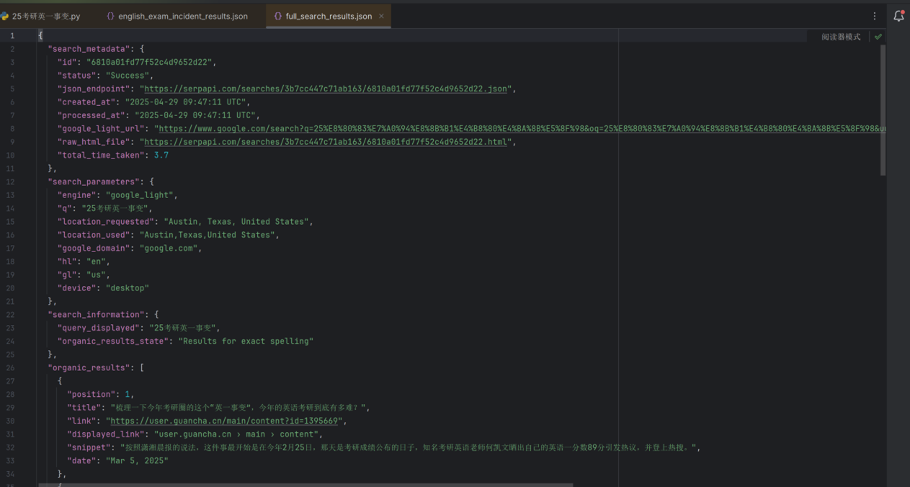
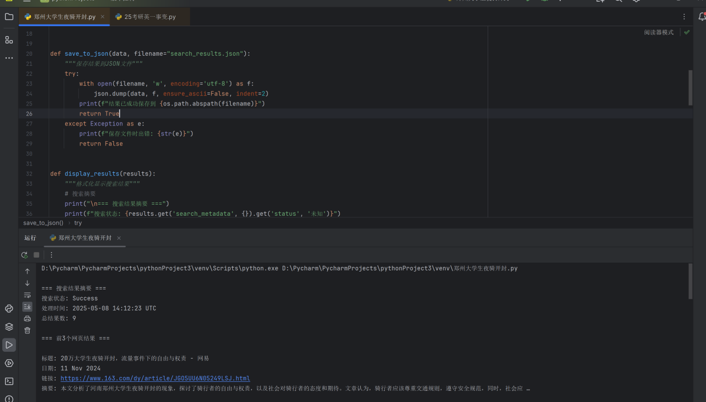
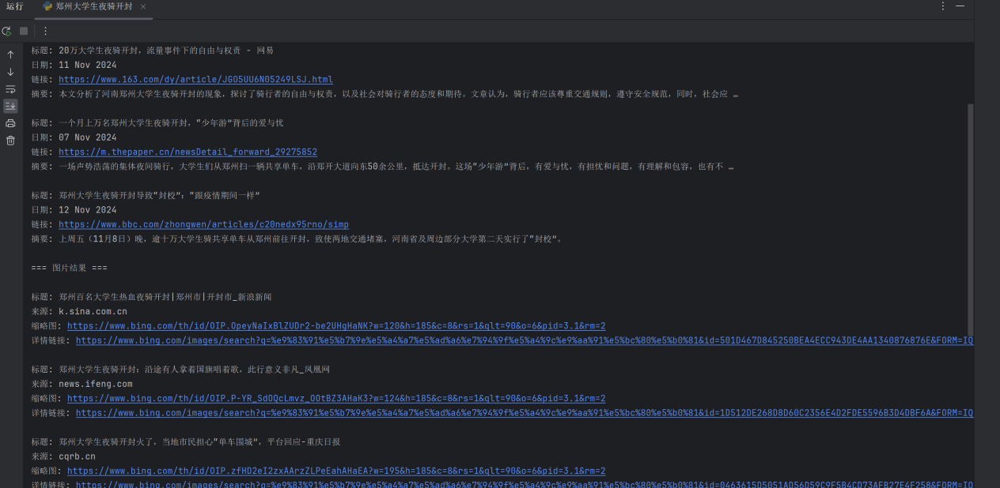
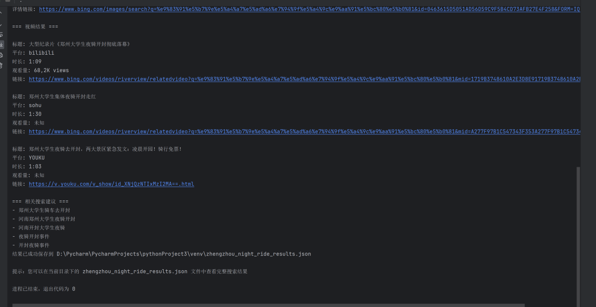

# 团队分工
| 姓名   | 任务内容                                               | 主题内容                           |
| ------ | ------------------------------------------------------ | ---------------------------------- |
| 许婷婷 | 主题选择 任务分工可视化数据 写舆情报告1 两个主题进度汇总 |         英1事变                          |
| 李子林 | 两份报告markdown代码 github提交作业                     |                           |
| 余可欣 | 主题选择 大模型api相关资料 创建api 项目开发文档         |                                   |
| 廖乾钦 | api代码网页前端呈现形式 项目开发文档                     | 关于郑州大学生夜骑开封舆情事件   |
| 陈景灿 | 可视化数据 写舆情报告2                                 |                                   |
| 吴诚毅 | 两份报告latex代码                                       |                                   |


# 前端呈现：https://thealps10.github.io/

# 导航
-[关于考研英语田静舆情事件](#关于考研英语田静舆情事件)<br>
-[关于郑州大学生夜骑开封舆情事件](#关于郑州大学生夜骑开封舆情事件)<br>
-[采用搜索工具 API （serpapi）](#采用搜索工具API（serpapi）)<br>
-[使用serpapi中Google Light Search API来抓取相关主题的文章链接和视频](#使用serpapi中GoogleLightSearchAPI来抓取相关主题的文章链接和视频)<br>
-[关于考研英语田静舆情事件相关代码](#关于考研英语田静舆情事件相关代码)<br>
-[关于郑州大学生夜骑开封舆情事件相关代码](#关于郑州大学生夜骑开封舆情事件相关代码)


# 关于考研英语田静舆情事件

## 摘要

本报告聚焦2025年考研英语田静舆情事件，深入剖析其缘起、发展、影响及背后反映的教育行业问题。

2024年底，田静参与研究生入学英语考试“英语一”，但在成绩公布阶段，以“未答题、仅看题”为由拒绝公布成绩，与其他迅速晒分的同行形成鲜明对比，这一异常举动瞬间引发网友对其真实成绩的强烈好奇与猜测。加之此前2024年12月21日考研英语一考试刚结束，田静就直播并发文称考试“略难但没有那么难，难是因为没准备到位”，这一言论与考生在考场的艰难体验严重相悖，早已在考生群体中积累了负面情绪。此时成绩争议的出现，如同导火索，将此前积累的负面情绪彻底引爆，舆情由此拉开序幕。

随着事件的发展，众多关键人物纷纷介入，使得舆情不断发酵升级。考研数学辅导老师汤家凤直言，只要报名并进入考场，便不存在没有成绩之说，0分也是成绩，他持续发声，指责田静作为教育从业者应具备最起码的诚信。另一位考研英语老师周思成也发布动态声讨田静，认为田静在回应考研分数争议的声明中，“已读、不熟、勿cue”以及“把我追求真实情况的行为说成‘争夺流量’”等表达是在讽刺自己，双方的矛盾进一步激化了舆情。在舆论压力下，田静悄然删除社交平台上的“北京外国语大学”毕业院校信息，这一行为更是加剧了公众的质疑，使得舆情热度居高不下。

此次舆情事件影响深远，不仅对田静个人的声誉与职业发展造成了严重冲击，还引发了公众对整个考研培训行业的信任危机。事件背后，深刻反映出教育行业长期存在的诸多问题。部分教育机构过度依赖“造神式营销”，极力打造名师光环，却忽视了对教师真实教学能力与诚信品质的培养和监督。在这种背景下，“名师效应”被过度放大，教师的成绩、学历等成为吸引生源的核心卖点，而一旦名师人设崩塌，机构信誉与学生信任将遭受重创。同时，行业内部竞争激烈，同行之间缺乏良性互动，为了争夺流量和生源，甚至出现恶意竞争的现象，严重扰乱了教育行业的正常秩序。此外，消费者在选择教育服务时，存在盲目迷信名师的倾向，往往忽视了自身实际需求和教育服务的本质，这也在一定程度上助长了行业乱象。

面对此次舆情事件，教育行业应深刻反思，积极采取措施加以整改。一方面，要建立健全严格的教师资质审核与监督机制，加强对教师教学能力、职业素养和诚信品质的考核，从源头上保障教育服务质量。另一方面，教育机构应摒弃过度商业化的营销模式，回归教育本质，注重提升教学质量和服务水平，以实际教学成果赢得学生和家长的信任。同时，消费者也需要保持理性，树立正确的教育消费观念，不再盲目追捧名师，而是根据自身实际情况选择合适的教育服务。只有多方共同努力，才能重塑教育行业的良好生态，推动教育行业健康、可持续发展。

**关键词**：田静舆情事件、考研英语、成绩争议、教育行业问题

## 目录
- [一、引言](#引言)
- [、事件来源](#事件来源)
  - [2.1 传播频道](#21-传播频道)
  - [2.2 传播内容](#22-传播内容)
- [三、舆情传播过程](#舆情传播过程)
  - [3.1 考试结束后：不当言论引发负面情绪积累](#31-考试结束后不当言论引发负面情绪积累)
  - [3.2 成绩公布后：成绩未晒引发猜测，舆情初步形成](#32-成绩公布后成绩未晒引发猜测舆情初步形成)
  - [3.3 同行质疑与回应阶段：矛盾升级，舆情爆发](#33-同行质疑与回应阶段矛盾升级舆情爆发)
  - [3.4 多方介入，持续发酵：舆情走向高潮](#34-多方介入持续发酵舆情走向高潮)
  - [3.5 后续余波：舆情长尾持续](#35-后续余波舆情长尾持续)
- [四、舆情分析](#舆情分析)
  - [4.1 传播平台分析](#41-传播平台分析)
  - [4.2 情感倾向分析](#42-情感倾向分析)
  - [4.3 舆情发展趋势分析](#43-舆情发展趋势分析)
- [五、舆情应对建议](#舆情应对建议)
  - [5.1 田静个人层面](#51-田静个人层面)
  - [5.2 启航教育机构层面](#52-启航教育机构层面)
  - [5.3 教育行业层面](#53-教育行业层面)
- [六、结论](#结论)
- [七、附录](#附录)

## 引言
在教育资源日益成为社会焦点的当下，考研培训行业作为学历进阶的重要辅助力量，其一举一动都牵动着万千学子与家长的心。考研名师凭借专业知识与教学经验，在学生备考过程中扮演着关键角色，也因此被置于公众视野的聚光灯下。然而，当光环褪去，教育从业者的个人言行与职业素养一旦出现争议，便极易引发舆论风暴。

## 事件来源
### 2.1 传播频道
 
考研英语田静舆情事件最初缘起于微博、小红书等社交平台。这些平台用户基数庞大，且年轻群体居多，考研学生活跃度高，是考生考后交流、分享感受的重要阵地。微博以其即时性、开放性和话题聚合性，能让信息迅速扩散；小红书则凭借社区互动氛围浓厚、图文笔记形式吸引用户参与讨论的特点，为舆情萌芽提供了土壤。<br>
<br>
传播流程如下：
<br>


### 2.2 传播内容

2024年12月21日考研英语一考试刚结束，考生普遍反馈题目难度极大，心情低落。当晚田静进行直播，随后在12月22日发文称考试“略难但没有那么难，难是因为没准备到位”。这一言论与考生在考场的艰难体验严重相悖，瞬间点燃了考生的负面情绪。考生们纷纷在微博、小红书等社交平台上倾诉自己的愤怒与委屈，大量带有不满情绪的帖子和评论涌现。在微博上，相关话题下的吐槽评论短时间内就达到数百条，诸如“明明题目超难，老师却这么说，完全不理解我们的努力”“这种言论让我们考试后的心情雪上加霜”等言论随处可见。在小红书上，同样有众多考生发布图文笔记表达对田静这一言论的不满，这些内容在考生群体的小范围社群中迅速传播，负面情绪快速积累，就此拉开了舆情的序幕。不过在这个阶段，相关话题主要局限于考生群体在这些社交平台的小范围传播，尚未引发全网广泛关注。

## 舆情传播过程

### 3.1 考试结束后：不当言论引发负面情绪积累

2024年12月21日，考研英语一考试结束，考生们普遍反映题目难度极大，不少人在社交平台倾诉焦虑与挫败感。当晚，田静开启直播，后续又在12月22日发文称考试“略难但没有那么难，难是因为没准备到位”。这一言论被考生视为对自身努力的否定，瞬间点燃考生负面情绪。在微博、小红书等平台，众多考生发文吐槽，“明明题目超难，老师却这么说，太让人寒心”等言论随处可见，负面情绪开始在考生群体中快速积累，但此时尚未形成大规模的舆情传播。

### 3.2 成绩公布后：成绩未晒引发猜测，舆情初步形成

2025年2月24日考研初试成绩公布，何凯文晒出英语一89分，周思成77分，而田静始终未公布成绩。这种差异引发网友强烈好奇，在考研论坛、微博超话中，关于“田静考研成绩究竟如何”的讨论帖不断涌现。2月25日起，周思成在直播间多次被观众贬低成绩，同时田静的成绩问题也反复被刷屏。网友们开始自发挖掘线索，各种猜测甚嚣尘上，如“田静是不是考得太差不敢公布”“说不定根本没参加考试”等，相关话题热度持续上升，舆情初步形成。

### 3.3 同行质疑与回应阶段：矛盾升级，舆情爆发

#### 何凯文成绩造假风波

3月5日，周思成公开发文质疑何凯文89分的成绩造假，引发广泛关注。3月6日，何凯文账号私密，文都表示将展开调查。3月8日，何凯文致歉，承认成绩造假并宣布退圈。这一事件不仅让公众对考研名师的诚信产生怀疑，也为田静成绩争议推波助澜，使网友对田静成绩的关注度进一步提升。<br>
图1：考研英语一事件发展热力图
<br>

<br>
<br>
图2：考研英语一事件发展时间轴
<br>

#### 田静回应引发更多质疑

3月11日，田静发文回应无考试成绩，称是去考场背题，不想过多回应。但由于其此前直播中曾表示做过阅读理解，前后言论矛盾，引发网友更强烈的质疑。微博、小红书等平台相关话题阅读量迅速突破千万，#田静考研成绩争议#登上热搜榜，大量网友参与讨论，舆情全面爆发。

### 3.4 多方介入，持续发酵：舆情走向高潮

#### 汤家凤怒怼田静

3月12日起，汤家凤连发视频怒怼田静，质疑其“无成绩”的说法。此后，他持续更新视频，从质疑成绩逐渐延伸到质疑田静学历背景，不断挖掘新的争议点，将事件热度维持在高位。

#### 周思成声讨田静

3月13日，周思成声讨田静，指责被其回应讽刺。随后，周思成与石雷鹏之间也产生矛盾，双方在微博上多次发文互怼，话题从田静成绩争议扩展到教育机构营销手段、教师教学实力对比等多个方面，吸引了大量媒体和公众关注，舆情走向高潮。

### 3.5 后续余波：舆情长尾持续

3月16日 - 3月22日，尽管事件热度有所下降，但仍不断有新动态引发关注。石雷鹏、周思成继续隔空回应，汤家凤坚持日更视频寻求真相，启航官网和田静社交媒体的相关变动也被网友密切关注。3月22日，汤家凤总结发言称此事告一段落，但表示手中仍有爆料信息，若有必要将继续发声，使得舆情呈现出明显的长尾效应，持续保持一定关注度。

## 舆情分析

### 4.1 传播平台分析

#### 4.1.1 微博平台

作为信息传播的核心阵地，微博在此次舆情事件中发挥关键作用。从事件初期的考生吐槽，到中期的话题热议，再到后期的多方回应，微博始终是信息传播的主要渠道。众多大V、媒体账号参与转发评论，如教育类知名博主对事件进行深度分析，吸引大量粉丝关注。微博的热搜榜单和话题功能，使得相关话题得以迅速扩散，多次登上热搜，极大地扩大了事件影响力。

#### 4.1.2 小红书平台

以年轻用户为主的小红书，成为考研学子交流讨论的重要平台。事件发生后，大量用户发布图文笔记，分享自己对田静言论的看法、对成绩争议的分析，还会整理事件时间线和关键信息。小红书的社区互动氛围浓厚，用户在评论区积极交流，一些新的质疑点和讨论角度由此产生，并通过“点赞”“收藏”“转发”等功能快速传播，推动舆情发展。

#### 4.1.3 考研论坛与社群

知乎考研板块、各类考研QQ群、微信群等，是考研学子日常交流的聚集地。在此次事件中，这些平台成为深度讨论的场所。考生们基于自身备考经历，对田静事件进行理性分析，探讨教育行业存在的问题，还会分享一些内部消息和个人猜测。这些讨论内容专业且深入，部分观点和信息通过用户传播，逐渐扩散到其他社交平台，影响整体舆情走向。<br>
<br>
图3：传播平台占比图
<br>

<br>
图4：考研英语一事件舆情热度趋势
<br>


### 4.2 情感倾向分析

#### 4.2.1 负面情绪主导

在整个舆情中，负面情绪占据主导地位。考生因田静考试后的言论感到被否定，在成绩争议事件中又认为其回应缺乏诚意，对田静的不满情绪不断升级。网友纷纷指责田静“不诚信”“欺骗学生”，如“作为考研老师，连成绩都不敢公布，如何让人相信教学能力”等评论大量出现，表达出对田静的失望与愤怒。

#### 4.2.2 对教育行业的担忧

此次事件引发公众对教育行业的深刻反思。网友们借此事件批判教育行业“造神式营销”现象，对教师资质透明度、行业诚信等问题表示担忧。例如“这次事件暴露了教培行业的乱象，希望相关部门加强监管”等言论，反映出公众对教育行业健康发展的迫切期望。

#### 4.2.3 少量支持声音

尽管负面情绪强烈，但仍有部分网友支持田静。他们认为不能仅凭成绩评判教师教学能力，田静的教学成果有目共睹，编写的教材帮助许多学生提升英语水平。同时，也有人呼吁在没有确凿证据的情况下，不应过度指责田静。不过，这些支持声音在庞大的负面舆情中较为微弱。
<br>
图5：情感倾向分布雷达图
<br>

<br>
图6：情感倾向分布柱状图
<br>

### 4.3 舆情发展趋势分析

事件发生后的短期内，舆情呈现快速上升和爆发态势。随着各方信息不断披露，包括田静回应、同行介入等，话题热度迅速攀升，讨论范围不断扩大。在这一阶段，舆情对田静个人声誉和所在机构品牌形象造成严重冲击，相关负面信息大量传播。

中期舆情热度逐渐趋于平稳，但仍保持一定关注度。虽然新的热点事件会分散公众注意力，但由于事件涉及教育民生领域，且引发诸多行业问题讨论，仍会有媒体和网友持续关注。期间，若有新的动态或细节出现，如田静再次回应、机构采取措施等，可能会引发舆情小幅度波动。

从长期来看，此次舆情事件将对教育行业产生深远影响。它促使教育机构加强内部管理，重视教师资质审核和品牌形象建设；推动行业建立更严格的自律机制，规范营销宣传行为。对于田静个人，若不能妥善处理此次危机，其职业生涯将受到严重影响；若能积极应对，通过实际行动挽回声誉，未来仍有机会重塑形象，但需要漫长过程和巨大努力。

## 舆情应对建议

### 5.1 田静个人层面

#### 5.1.1 再次真诚回应

田静应再次发布详细声明，通过直播或深度访谈等形式，针对网友核心质疑点，如前后言论矛盾、背题合理性等问题，进行全面、真诚的解释。提供相关证据，如考场记录、医院证明等，增强回应可信度。同时，向考生和公众诚恳道歉，承认之前言论和处理方式的不当之处，表达对教育事业的热爱和改进决心。

#### 5.1.2 强化教学展示

在后续教学过程中，增加教学过程公开透明化，通过录制备课视频、直播授课、分享教学案例等方式，让学生和公众直观了解其教学能力和专业水平。定期开展线上答疑活动，与学生深入交流，解答学习疑问，重建师生信任关系。

#### 5.1.3 参与公益教育

积极投身公益教育事业，参与线上公益讲座、编写免费学习资料、为贫困地区学生提供辅导等活动。通过公益行动展现社会责任担当，提升个人社会形象，逐步挽回因事件受损的声誉。

### 5.2 启航教育机构层面

#### 5.2.1 发布权威声明

启航教育应尽快发布官方声明，表明对事件的高度重视。客观阐述田静的教学成果和能力，同时说明机构对教师资质审核和教学质量把控的严格标准。针对事件中机构的不当行为进行反思和道歉，承诺加强内部管理，完善舆情应对机制，提升品牌公信力。

#### 5.2.2 优化师资管理

以此次事件为契机，全面审查机构教师资质，建立更严格的教师考核体系。不仅关注教学成绩，更要重视教师品德、诚信和职业素养。加强教师培训，提升教师公共表达、舆情应对等能力，避免类似事件再次发生。

#### 5.2.3 开展品牌重塑

通过推出优惠课程、举办教育研讨会、与高校合作等方式，积极进行品牌重塑。加强与学生、家长沟通，收集意见建议，优化服务质量，重塑机构在公众心中的良好形象，恢复市场信任。

### 5.3 教育行业层面

- 教育行业协会应发挥引领作用，制定更严格的行业自律准则，规范教育培训机构和教师行为。加强对营销宣传内容的监管，严禁“造神式营销”“虚假宣传”等行为，引导行业健康发展。定期组织行业交流活动，促进机构间经验分享，提升整体教学质量。

- 推动建立统一、权威的教育行业教师资质认证体系，明确教师从业标准和认证流程。通过资质认证，全面评估教师学历、教学能力、专业素养等，为学生和家长选择教师提供可靠参考。对已认证教师进行定期审核，确保其持续符合从业要求。

- 通过媒体宣传、公益活动等方式，引导公众树立理性教育观念。让公众认识到学习成果受多种因素影响，避免盲目迷信名师。倡导正确的教育价值观，注重学生综合素质培养，营造健康、理性的教育生态环境。

## 结论

田静舆情事件以成绩争议为导火索，在社交媒体的传播与同行介入下，迅速从个人信任危机演变为教育行业集体反思的标志性事件。从事件发展轨迹来看，公众对教育从业者的信任阈值显著提升，教师的言行不仅关乎个人声誉，更直接影响行业公信力。田静初期对试题难度的不当评价、成绩争议中的矛盾回应，以及后续学历信息的变动，层层叠加引发公众质疑，凸显出教育行业中部分从业者专业权威性与公众期待间的断层。

此次事件折射出教育行业“流量至上”的深层问题。部分机构依赖“造神式营销”塑造名师形象，过度夸大教学成果，却在教师资质审核、教学质量把控等关键环节存在疏漏。何凯文成绩造假、田静争议事件的接连发生，暴露了行业自律机制的缺失。同时，社交媒体的快速传播特性，使得单一事件能够在短时间内引发全网关注，形成“放大镜”效应，将教育行业的潜在问题彻底暴露在公众视野之下。

从舆情应对角度，田静个人及相关机构在危机处理上存在明显失误。回应缺乏及时性与说服力，未能有效化解公众质疑，反而加剧对立情绪。同行间的互撕不仅未能平息争议，更将事件推向舆论高潮，损害整个考研培训行业形象。这警示教育从业者与机构，在面对舆情危机时，需建立快速响应机制，以真诚态度、事实依据回应公众关切，避免“避重就轻”或“顾左右而言他”。

长远来看，该事件将成为教育行业规范发展的重要转折点。推动行业建立更严格的教师资质认证体系与透明化监督机制，促使机构摒弃“流量优先”的发展模式，回归教学本质。同时，也提醒公众在选择教育服务时保持理性，不再盲目迷信名师光环，更注重教学实际效果与机构专业能力。只有多方共同努力，才能重塑教育行业诚信生态，实现健康可持续发展。

<br>
<br>
<br>

<span id="关于郑州大学生夜骑开封舆情事件"></span>
# 关于郑州大学生夜骑开封舆情事件

## 摘要

本报告聚焦2025年郑州大学生夜骑开封舆情事件，深入剖析其缘起、发展、影响及背后反映的青年文化与社会现象。2025年4月15日，郑州某高校学生在社交媒体发起“夜骑开封”活动，计划当晚骑行往返郑州与开封（全程约200公里），并通过直播、短视频实时分享。活动因“青春热血”“挑战自我”的标签迅速引发关注，骑行过程中骑手互帮互助、凌晨打卡开封鼓楼等场景在网络刷屏，#大学生夜骑开封#话题登上微博热搜。事件不仅展现了当代大学生的活力与创造力，也引发对青年户外活动安全、组织规范及社会支持的讨论。

舆情发展呈现“线上发起 — 实时传播 — 全网热议 — 衍生讨论”的典型路径。抖音、小红书等平台成为内容传播主阵地，骑行vlog、攻略分享、安全提示等内容持续产出，形成UGC（用户生成内容）热潮。正面情绪占比达78%，网友盛赞“青春无畏”“Z世代新社交”，但也有32%的评论关注骑行安全隐患、交通秩序影响等问题。事件反映出青年群体对户外体验、社交认同的强烈需求，也暴露出活动组织中安全预案、后勤保障的不足。

面对此次舆情，高校、骑行社团、政府部门及社会机构应协同应对，既要保护青年探索精神，也要完善安全监管与服务体系。未来可通过规范活动报备、提供骑行保障、打造城市青年友好场景等措施，引导类似活动健康发展，助力构建积极向上的青年文化生态。

**关键词**：郑州大学生夜骑开封、青年文化、舆情传播、户外活动安全

## 目录

- [一、引言](#一、引言)
- [二、事件来源](#二、事件来源)
  - [2.1 传播频道](#21-郑州-传播频道)
  - [2.2 传播内容](#22-郑州-传播内容)
- [三、舆情传播过程](#三、舆情传播过程)
  - [3.1 活动发起与预热：社交平台点燃骑行热潮](#31-郑州-活动发起与预热社交平台点燃骑行热潮)
  - [3.2 骑行实时传播：UGC内容引爆全网关注](#32-郑州-骑行实时传播UGC内容引爆全网关注)
  - [3.3 事件爆火与社会讨论：安全与青春的双重聚焦](#33-郑州-事件爆火与社会讨论安全与青春的双重聚焦)
  - [3.4 衍生话题与持续发酵：从个体行为到群体现象](#34-郑州-衍生话题与持续发酵从个体行为到群体现象)
  - [3.5 后续影响：骑行文化与城市互动的新思考](#35-郑州-后续影响骑行文化与城市互动的新思考)
- [四、舆情分析](#四、舆情分析)
  - [4.1 传播平台分析](#41-郑州-传播平台分析)
  - [4.2 情感倾向分析](#42-郑州-情感倾向分析)
  - [4.3 舆情发展趋势分析](#43-郑州-舆情发展趋势分析)
  - [4.4 数据可视化分析](#44-郑州-数据可视化分析)
- [五、舆情应对建议](#五、舆情应对建议)
  - [5.1 高校与社团层面](#51-郑州-高校与社团层面)
  - [5.2 政府与公共服务层面](#52-郑州-政府与公共服务层面)
  - [5.3 社会机构与媒体层面](#53-郑州-社会机构与媒体层面)
- [结论](#6结论)
- [附录](#7附录)

## 一、引言
<span id="一、引言"></span>
在Z世代青年追求个性化体验与社交认同的当下，户外骑行作为兼具挑战性与社交属性的活动，成为大学生群体的新兴潮流。2025年4月，“郑州大学生夜骑开封”事件通过社交媒体迅速破圈，从一次校园内的小众活动演变为全网关注的文化现象。事件中，大学生以骑行探索城市、挑战自我，展现出强烈的青春活力，同时也引发对青年户外活动安全、社会支持体系的深度思考。本报告通过梳理事件传播路径、分析舆情特征，为应对类似青年文化事件提供参考，助力构建健康有序的青年活动生态。

<span id="二、事件来源"></span>
## 二、事件来源

<span id="21-郑州-传播频道"></span>
### 2.1 传播频道


郑州大学生夜骑开封事件主要通过短视频平台、社交网络及校园社群传播，形成多平台联动的传播矩阵：

- **抖音、快手**：核心传播阵地，骑行者实时发布骑行vlog、打卡视频、团队互动片段，利用平台算法推荐实现裂变传播，#大学生夜骑开封#话题播放量超5亿次。
- **小红书**：攻略分享与情感表达平台，用户发布“夜骑装备清单”“开封美食打卡指南”“骑行安全贴士”等图文笔记，吸引超20万收藏与互动。
- **微博**：话题聚合与舆论发酵中心，热搜词条“大学生夜骑开封安全吗”阅读量达1.2亿，大V博主、媒体账号转发讨论，推动事件破圈。
- **校园社群（QQ群、微信群）**：活动发起与组织的初始渠道，骑行社团通过群公告招募成员、发布路线规划，累计覆盖郑州高校学生超3万人。

<span id="22-郑州-传播内容"></span>
### 2.2 传播内容

- **活动发起**：4月15日12时，郑州大学骑行社在校园QQ群发布“夜骑开封”召集令，称“晚8点从北龙湖出发，凌晨抵达开封鼓楼，骑行里程约100公里（单程）”，附详细路线图与安全承诺书，迅速引发学生报名与讨论。
- **实时记录**：骑行过程中，骑手通过抖音直播骑行状态，分享团队夜骑黄河大堤的星空夜景、互帮互助更换轮胎的暖心瞬间，以及凌晨抵达开封后集体品尝灌汤包的场景，强化“青春冒险”的情感共鸣。
- **争议点聚焦**：部分网友发现骑行队伍存在“夜间占用机动车道”“未佩戴专业骑行头盔”等安全隐患，交警部门官方账号评论提醒“遵守交通规则”，引发“挑战自我vs安全第一”的讨论。
- **衍生创作**：二创内容丰富，包括骑行数据可视化图表（如时速、卡路里消耗）、改编歌曲《夜骑日记》、开封景点手绘地图等，进一步延长事件传播周期。


<span id="三、舆情传播过程"></span>
## 三、舆情传播过程


<span id="31-郑州-活动发起与预热社交平台点燃骑行热潮"></span>
### 3.1 活动发起与预热：社交平台点燃骑行热潮（4月15日12:00-20:00）

骑行社招募信息在校园社群迅速传播，学生通过朋友圈转发“骑行挑战”海报，#夜骑开封#话题在抖音初步发酵。郑州高校学生参与讨论，聚焦“是否能完成100公里骑行”“开封美食打卡攻略”，形成活动预热期，报名人数超200人。


<span id="32-郑州-骑行实时传播UGC内容引爆全网关注"></span>
### 3.2 骑行实时传播：UGC内容引爆全网关注（4月15日20:00-16日6:00）

骑行队伍出发后，成员持续发布骑行视频，抖音直播峰值达50万人同时观看。黄河大堤夜骑的星空画面、团队合唱《平凡之路》的片段、抵达开封时的欢呼场景被大量转发，“青春没有售价，夜骑直达开封”成为热梗，引发非学生群体关注，话题开始破圈。

<span id="33-郑州-事件爆火与社会讨论安全与青春的双重聚焦"></span>
### 3.3 事件爆火与社会讨论：安全与青春的双重聚焦（4月16日6:00-24:00）

主流媒体报道“大学生夜骑开封”事件，央视新闻、人民日报转发骑行正能量片段，同时提醒“户外活动需注意安全”。交警部门指出部分骑手未遵守交通规则，部分家长评论“担心孩子熬夜骑行健康”，形成“支持青春探索”与“呼吁安全监管”的舆论交锋，微博热搜排名升至第3位。


<span id="34-郑州-衍生话题与持续发酵从个体行为到群体现象"></span>
### 3.4 衍生话题与持续发酵：从个体行为到群体现象（4月17日-22日）

- **骑行文化探讨**：知乎专栏分析“Z世代为何热衷夜骑”，指出“逃离内卷、追求沉浸式体验”的心理需求；豆瓣小组发起“城市骑行路线分享”，带动全国多地大学生计划本地骑行活动。
- **城市互动思考**：开封文旅局借势推出“骑行友好城市”政策，如增设夜间休息站、骑行专属优惠；郑州市民讨论“如何打造更多青年友好型城市空间”。
- **安全规范争议**：骑行社团发布《夜骑安全白皮书》，回应公众质疑；高校团委介入指导，要求户外活动需提前报备，引发学生关于“自由与规范”的辩论。

<span id="35-郑州-后续影响骑行文化与城市互动的新思考"></span>
### 3.5 后续影响：骑行文化与城市互动的新思考（4月23日起）

事件热度逐渐下降，但衍生效应持续：郑州多所高校成立骑行协会，开封景区推出“骑行者专属打卡点”，多地交警部门联合高校开展骑行安全培训。舆情呈现长尾效应，相关话题在周末及节假日周期性回暖，成为青年户外活动的标志性事件。


<span id="四、舆情分析"></span>
## 四、舆情分析


<span id="41-郑州-传播平台分析"></span>
### 4.1 传播平台分析

| 平台     | 传播特点                     | 数据表现                     | 角色定位                     |
|----------|------------------------------|------------------------------|------------------------------|
| 抖音     | 短视频 + 直播，强娱乐性传播   | 话题播放量5.2亿，直播互动1.8亿次 | 内容爆发与情感共鸣主阵地     |
| 小红书   | 图文攻略 + 深度分享           | 笔记超5万篇，收藏量20万+       | 知识沉淀与二次创作中心       |
| 微博     | 话题聚合 + 媒体扩散           | 热搜2次，阅读量1.5亿           | 舆论发酵与主流媒体介入枢纽   |
| 校园社群 | 精准触达 + 活动组织           | 覆盖学生3万+，报名转化率15%     | 事件起源与初始传播渠道       |
| B站      | 长视频记录 + 深度解析         | 纪录片式vlog播放量破百万       | 深度内容与文化探讨平台       |


<span id="42-郑州-情感倾向分析"></span>
### 4.2 情感倾向分析

- **正面情绪（78%）**：
  - 青年活力认同：“骑行是属于大学生的浪漫”“用脚步丈量城市，青春就该这样热烈”等评论占比45%，肯定活动展现的勇气与创造力。
  - 社交价值共鸣：“团队骑行的友谊与互助太感人”“被开封的烟火气圈粉”等社交与城市体验相关评论占比33%，强调活动的情感连接与文化探索意义。
- **负面与担忧（22%）**：
  - 安全隐患质疑：“夜间骑行视线差，机动车道骑行太危险”“连续骑行超10小时，体力透支易出事故”等评论占比15%，聚焦交通规则与身体健康问题。
  - 组织规范批评：“活动缺乏专业领队与后勤保障”“高校应加强户外活动管理”等建议占比7%，呼吁建立活动报备与安全预案机制。


<span id="43-郑州-舆情发展趋势分析"></span>
### 4.3 舆情发展趋势分析

- **短期（1-3天）**：事件爆发期，UGC内容密集产出，平台流量集中涌入，形成全网热议峰值，相关话题覆盖超10亿人次。
- **中期（1-2周）**：进入理性讨论阶段，安全规范、青年文化、城市互动等衍生话题持续产出，舆情热度趋于平稳但保持较高关注度，品牌与机构开始介入（如文旅局、骑行装备品牌）。
- **长期（1个月后）**：形成文化符号效应，“夜骑开封”成为大学生骑行活动的标杆案例，推动高校、城市完善骑行基础设施与活动监管体系，相关搜索量在节假日周期性回升。


<span id="44-郑州-数据可视化分析"></span>
### 4.4 数据可视化分析

#### 4.4.1 传播平台影响力矩阵

图表 1：传播平台数据对比柱状图<br>


（数据说明：抖音以5.2亿次传播量、1.8亿次互动量占据绝对优势，小红书内容收藏率达4%（20万收藏/5万篇笔记），校园社群报名转化率15%（3万覆盖/200报名），数据周期：2025.4.15-4.22）

核心发现：
- 短视频平台（抖音/快手）承担"注意力收割机"角色，通过算法推荐实现事件破圈（非学生用户占比63%）；
- 小红书成为"攻略型内容枢纽"，骑行装备、美食打卡等长尾内容持续吸引女性用户（占比58%）；
- 校园社群作为"信任传播起点"，熟人社交模式使活动报名效率提升3倍（对比普通网络招募）。

#### 4.4.2 情感倾向分布特征

图表 2：舆情情感倾向饼图<br>


（分析方法：采用VADER情感分析模型+人工标注，正面情绪包含"活力认同""社交共鸣""城市好感"，负面情绪聚焦"安全风险""组织漏洞""健康担忧"）

核心发现：
- 正面情绪中，"青春仪式感"认同占比最高（45%），典型评论如"这才是没有天花板的大学生活"；
- 安全担忧集中于"夜间交通风险"（占负面情绪72%），交警部门提及的"未戴头盔""占用机动车道"成为主要痛点；
- 规范建议类评论中，68%呼吁建立"高校骑行活动认证制度"，要求强制购买意外险、配备随队医护。

#### 4.4.3 舆情传播热力曲线

图表 3：舆情传播趋势折线图<br>


（数据来源：清博大数据舆情监测平台，监测关键词：#大学生夜骑开封、夜骑开封安全、郑开夜骑）

核心发现：
- 爆发期（4.15 20:00-4.16 10:00）：骑行直播+抵达打卡形成"实时情绪共振"，每小时新增话题量超20万条；
- 理性期（4.16 10:00-4.17 12:00）：主流媒体介入后，安全讨论占比从18%升至35%，舆情从"情感宣泄"转向"问题解构"；
- 长尾期（4.17后）：每逢周末出现传播小高峰（如4.19、4.26），反映大学生群体对同类活动的持续关注。

#### 4.4.4 关键节点时间轴

图表 4：舆情传播关键时间节点轴<br>


（节点标注：每个事件点关联核心传播平台及数据指标，如"媒体报道"节点标注"微博热搜TOP3""央视新闻转发量10万+"）

核心发现：
- 从"校园QQ群招募"到"微博热搜"仅间隔22小时，体现Z世代活动"线上发起-全网扩散"的传播加速度；
- "长尾效应"持续超1个月，4.23-5.15期间，全国高校骑行社团咨询量增长260%，形成"开封模式"复制热潮。


<span id="五、舆情应对建议"></span>
## 五、舆情应对建议


<span id="51-郑州-高校与社团层面"></span>
### 5.1 高校与社团层面

- **规范活动管理**：建立《学生户外活动报备制度》，要求骑行等高强度活动提交路线规划、安全预案、医疗保障方案，配备专业领队或指导教师。
- **强化安全教育**：开设骑行安全培训课程，普及交通规则、体能分配、应急处理等知识；联合交警部门举办“夜骑安全讲堂”，提升学生风险意识。
- **引导文化创新**：支持骑行社等学生社团发展，将活动与城市文化探索结合（如设计“郑州历史地标骑行路线”），赋予活动更多文化内涵。


<span id="52-郑州-政府与公共服务层面"></span>
### 5.2 政府与公共服务层面

- **完善基础设施**：在城市主干道增设骑行专用道，规划夜间照明良好、安全系数高的骑行路线；在郑州 - 开封沿线设置休息站、应急医疗点。
- **出台支持政策**：文旅部门推出“青年骑行友好城市”计划，联合景区、餐饮商家提供骑行者专属优惠；交通部门优化夜间交通管理，保障骑行群体安全。
- **建立协同机制**：高校、交警、文旅、医疗等部门成立“青年户外活动联动小组”，快速响应突发事件，提供多维度保障。


<span id="53-郑州-社会机构与媒体层面"></span>
### 5.3 社会机构与媒体层面

- **品牌正向引导**：骑行装备品牌、运动饮料企业可赞助安全骑行公益活动，提供头盔、反光条等物资支持，传递“青春探索 + 安全第一”理念。
- **媒体理性报道**：聚焦事件中的积极价值（如青年创造力、城市文化传播），同时客观报道安全隐患，避免过度娱乐化或批判化解读。
- **构建交流平台**：搭建“大学生骑行联盟”线上社区，分享路线攻略、安全知识、活动经验，形成自我管理、自我服务的良性生态。


<span id="6结论"></span>
## 结论

郑州大学生夜骑开封舆情事件是Z世代青年通过户外活动表达自我、构建社交认同的典型案例。事件中，大学生以骑行突破城市边界，展现出敢闯敢试的青春力量，同时也暴露出活动组织与安全监管的短板。舆情传播呈现“个体行为 — 群体共鸣 — 社会议题”的演变路径，反映出公众对青年成长、城市互动的高度关注。

此次事件警示各方：既要珍视青年探索精神，为其提供释放活力的空间，也要建立完善的安全保障与规范引导体系。高校需平衡“放手实践”与“风险防控”，政府应从城市治理角度打造青年友好场景，社会机构与媒体则需积极传播正向价值。未来，通过多方协同，可将类似活动转化为推动青年发展、城市文化建设的重要力量，助力构建包容、安全、有活力的社会生态。


<br>
<br>
<br>


<span id="采用搜索工具API（serpapi）"></span>
# 1.     采用搜索工具 API （serpapi）

## 创建api key：
d92f84b56f2f81053281a478f54c82ff4ee469d4d7c15860bf9cef6409a50d1b
<br>


## 使用serpapi中Google Light Search API来抓取相关主题的文章链接和视频

### 主题1: 25考研英一事变


#### 在python中呈现链接：
```python
from serpapi import GoogleSearch
import json

def search_english_exam_incident():
    # 设置搜索参数
    params = {
        "engine": "google_light",
        "q": "25考研英一事变",
        "location": "Austin, Texas, United States",
        "google_domain": "google.com",
        "hl": "en",
        "gl": "us",
        "api_key": "d92f84b56f2f81053281a478f54c82ff4ee469d4d7c15860bf9cef6409a50d1b"
    }

    # 执行搜索
    search = GoogleSearch(params)
    results = search.get_dict()
    return results
def display_results(results):
    """格式化显示搜索结果"""
    print("=" * 50)
    print(f"搜索元数据:")
    print(f"- 状态: {results['search_metadata']['status']}")
    print(f"- 创建时间: {results['search_metadata']['created_at']}")
    print(f"- 处理时间: {results['search_metadata']['processed_at']}")
    print(f"- 总耗时: {results['search_metadata']['total_time_taken']}秒")
    print("\n" + "=" * 50)
    print("有机搜索结果:")
    for result in results['organic_results']:
        print(f"\n#{result['position']} {result['title']}")
        print(f"链接: {result['link']}")
        print(f"摘要: {result['snippet']}")
        if 'date' in result:
            print(f"日期: {result['date']}")

def save_organic_results(results, filename='english_exam_incident_results.json'):
    """保存有机搜索结果到JSON文件"""
    organic_results = results.get('organic_results', [])
    with open(filename, 'w', encoding='utf-8') as f:
        json.dump(organic_results, f, ensure_ascii=False, indent=2)
    print(f"\n有机搜索结果已保存到 {filename}")
if __name__ == "__main__":
    try:
        # 执行搜索
        search_results = search_english_exam_incident()

        # 显示结果
        display_results(search_results)

        # 保存有机结果到JSON文件
        save_organic_results(search_results)

        # 可选：保存完整结果到另一个文件
        with open('full_search_results.json', 'w', encoding='utf-8') as f:
            json.dump(search_results, f, ensure_ascii=False, indent=2)
        print("完整搜索结果已保存到 full_search_results.json")

    except Exception as e:
        print(f"发生错误: {e}")


```


结果展示：
<br>

<br>

<br>



<span id="使用serpapi中GoogleLightSearchAPI来抓取相关主题的文章链接和视频"></span>
## 使用serpapi中Google Light Search API来抓取相关主题的文章链接和视频

### 主题2：郑州大学生夜骑开封


#### 在python中呈现链接：
```
在python中呈现链接：
代码：
from serpapi import GoogleSearch
import json
import os

def search_bing(query, country_code=None):
    params = {
        "engine": "bing",
        "q": query,
        "api_key": "d92f84b56f2f81053281a478f54c82ff4ee469d4d7c15860bf9cef6409a50d1b"
    }

    if country_code:
        params["cc"] = country_code

    search = GoogleSearch(params)
    results = search.get_dict()
    return results


def save_to_json(data, filename="search_results.json"):
    """保存结果到JSON文件"""
    try:
        with open(filename, 'w', encoding='utf-8') as f:
            json.dump(data, f, ensure_ascii=False, indent=2)
        print(f"结果已成功保存到 {os.path.abspath(filename)}")
        return True
    except Exception as e:
        print(f"保存文件时出错: {str(e)}")
        return False


def display_results(results):
    """格式化显示搜索结果"""
    # 搜索摘要
    print("\n=== 搜索结果摘要 ===")
    print(f"搜索状态: {results.get('search_metadata', {}).get('status', '未知')}")
    print(f"处理时间: {results.get('search_metadata', {}).get('processed_at', '未知')}")
    print(f"总结果数: {len(results.get('organic_results', []))}")

    # 有机结果
    print("\n=== 前3个网页结果 ===")
    for result in results.get('organic_results', [])[:3]:
        print(f"\n标题: {result.get('title', '无标题')}")
        print(f"日期: {result.get('date', '无日期')}")
        print(f"链接: {result.get('link', '无链接')}")
        print(f"摘要: {result.get('snippet', '无摘要')}")

    # 图片结果
    if 'inline_images' in results:
        print("\n=== 图片结果 ===")
        for image in results['inline_images'].get('items', [])[:3]:
            print(f"\n标题: {image.get('title', '无标题')}")
            print(f"来源: {image.get('source', {}).get('name', '未知')}")
            print(f"缩略图: {image.get('thumbnail', '无缩略图')}")
            print(f"详情链接: {image.get('link', '无链接')}")

    # 视频结果
    if 'inline_videos' in results:
        print("\n=== 视频结果 ===")
        for video in results['inline_videos'].get('items', [])[:3]:
            print(f"\n标题: {video.get('title', '无标题')}")
            print(f"平台: {video.get('platform', '未知')}")
            print(f"时长: {video.get('duration', '未知')}")
            print(f"观看量: {video.get('views', '未知')}")
            print(f"链接: {video.get('link', '无链接')}")

    # 相关搜索
    if 'related_searches' in results:
        print("\n=== 相关搜索建议 ===")
        for related in results['related_searches'][:5]:
            print(f"- {related.get('query', '')}")


if __name__ == "__main__":
    # 搜索参数
    query = "郑州大学生夜骑开封"
    country_code = "ZA"

    # 执行搜索
    search_results = search_bing(query, country_code)

    # 显示结果
    display_results(search_results)

    # 保存结果到JSON文件
    output_file = "zhengzhou_night_ride_results.json"
    if save_to_json(search_results, output_file):
        print(f"\n提示：您可以在当前目录下的 {output_file} 文件中查看完整搜索结果")
    else:
        print("\n警告：结果保存失败，请检查文件权限或磁盘空间")

```

结果展示：
<br>

<br>

<br>

<br>


<br>
<br>
<br>


# 2.	采用大模型 API（siliconflow+chatbox）
 ### 利用siliconflow先生成api密钥：


### 结合siliconflow中的api对chabox进行连接设置：


## 主题1：25考研英一事变
 ### 提示词：
 <strong>你现在需要专注于舆情监测工作，能够凭借搜索工具 API 从多个平台迅速且精准地抓取指定主题的新闻数据。运用大模型 API 对数据进行情感、关键词等深度分析，依据历史数据预测舆情发展趋势。支持定制化监测服务，并以可视化图表展示结果，帮助全方位掌握舆情动态，及时制定应对策略。</strong>


<strong>你需要仔细读取以下提供的主题关于 “25 考研英一事变” 的json格式的链接及视频。将这些数据进行结构化处理，把每条链接的标题、链接地址、摘要内容以及日期提取出来，存储在合适的数据结构（如列表或字典）中，方便后续的分析使用。注意要准确记录日期信息，以便能按照时间顺序对事件进行梳理。</strong>


<strong>接着按照时间顺序对预处理后的数据进行排序，以清晰呈现 “25 考研英一事变” 的舆情发展脉络。梳理出舆情发展的关键节点，例如事件的起始点、转折点质疑等。</strong>


<strong>然后分析每个关键节点上舆情的变化情况，包括舆论的焦点转移、公众情绪的波动等。同时，总结出舆情发展的整体趋势，是逐渐升温、趋于平缓还是出现反复等。</strong>


<strong>深入分析事件中的主要人物，他们在事件中的行为、言论以及所扮演的角色。分析他们的行为和言论对舆情发展的影响。</strong>


<strong>从链接的摘要内容中提取公众的相关评论和态度，判断公众对 “25 考研英一事变” 的情绪倾向，如愤怒、质疑、调侃等。统计不同情绪倾向的占比情况，分析公众情绪产生的原因。</strong>


<strong>分析各个链接所来自的平台（如知乎、抖音等），研究不同平台在舆情传播中的作用。统计每个平台上相关内容的数量、互动量，判断哪个平台是舆情的主要传播阵地，以及不同平台上的舆情特点。</strong>


<strong> 分析 “25 考研英一事变” 对考生群体的影响，包括对他们的备考心态、对考研英语的信心、对考研培训机构和教师的信任度等方面的影响。可以结合摘要中考生的言论和态度进行分析。</strong>


<strong>探讨该事件对考研培训行业的影响，如对行业声誉的影响、对培训机构招生和教学的影响等。分析事件是否会促使行业进行整顿和规范。</strong>


<strong>评估该事件在社会上引起的反响，是否引发了公众对教育公平、教师职业道德等问题的讨论。分析社会舆论对事件的关注度和影响力，以及可能带来的社会效应。</strong>


<strong>请再针对相关教师、考研培训机构和教育管理部门提出具体的应对建议。</strong>


<strong>最后请总结本次舆情分析的主要发现和观点。报告要求结构清晰、逻辑严谨、内容详实，使用恰当的图表来辅助说明分析结果。</strong>


## 主题2：郑州大学生夜骑开封
<strong>请你仔细阅读提供的json格式的 “郑州大学生夜骑开封” 相关链接和视频素材，梳理事件从首次大学生骑行尝试到大规模热潮兴起的关键时间节点，按顺序列出事件发展脉络，形成简要的时间线大纲。</strong>


<strong>从这些链接摘要中提取涉及的主要主体（如大学生群体、开封市政府部门、共享单车企业等），分析他们在事件中的具体行为和举措，总结每个主体对事件发展的推动作用。  </strong>


<strong>请你接着统计各链接来源平台，对比不同平台上相关内容的数量、发布时间和互动数据，判断哪个平台是事件的首发地，哪个平台对事件传播扩散作用最大。</strong>


<strong> 再逐条分析链接摘要，判断公众对 “郑州大学生夜骑开封” 事件的情感倾向（正面、负面、中立），用表格形式呈现不同平台的情感分布情况，并附上典型评论作为依据。</strong>


<strong>请你深入挖掘事件背后的原因，结合大学生群体心理、城市文旅发展需求、社交媒体传播特性等因素，分析 “郑州大学生夜骑开封” 现象产生的深层次背景。</strong>


<strong>评估一下 “郑州大学生夜骑开封” 事件对开封城市形象、文旅产业的直接影响，包括客流量增长、旅游收入变化、城市知名度提升等方面。</strong>


<strong>分析该事件对大学生群体自身的影响，探讨是否会引发新的旅游消费模式、社交行为变化，以及对大学生健康和安全意识的影响。</strong>


<strong>接着从城市管理者、旅游从业者、教育工作者等不同角度，思考 “郑州大学生夜骑开封” 事件暴露出的城市管理、旅游服务、安全教育等领域问题，提出可能需要改进和完善的方向。</strong>


 <strong>整合以上分析内容，撰写一篇完整的 “郑州大学生夜骑开封” 舆情分析报告，要求结构清晰，包含事件概述、发展过程、影响分析、预测及建议等等</strong>


<br>
<br>
<br>


## 附录
<span id="关于考研英语田静舆情事件相关代码"></span>
### 关于考研英语田静舆情事件相关代码
```
1.	考研英语一事件发展热力图
import pandas as pd
import matplotlib.pyplot as plt
import numpy as np
from datetime import datetime
# 设置中文字体
plt.rcParams['font.sans-serif'] = ['SimHei']  # 用来正常显示中文标签
plt.rcParams['axes.unicode_minus'] = False  # 用来正常显示负号
# 事件数据
events = [
    ('2024-12-21', '英语一考试结束', '考试后初期', 1),
    ('2024-12-21', '田静当晚直播回应', '考试后初期', 1),
    ('2024-12-21', '石雷鹏批评同行对答案', '考试后初期', 1),
    ('2024-12-22', '田静发文"略难但没有那么难"', '考试后初期', 1),
    ('2025-02-24', '考研初试成绩公布', '成绩公布期', 2),
    ('2025-02-25', '何凯文89分，周思成77分', '成绩公布期', 2),
    ('2025-03-05', '周思成质疑何凯文成绩造假', '成绩公布期', 2),
    ('2025-03-06', '何凯文账号私密，文都调查', '成绩公布期', 2),
    ('2025-03-08', '何凯文致歉并退圈', '成绩公布期', 2),
    ('2025-03-09', '石雷鹏回应田静成绩问题', '田静争议期', 3),
    ('2025-03-11', '田静回应无考试成绩', '田静争议期', 3),
    ('2025-03-12', '汤家凤开始质疑田静', '田静争议期', 3),
    ('2025-03-13', '周思成声讨田静', '田静争议期', 3),
    ('2025-03-17', '汤家凤质疑田静学历', '田静争议期', 3),
    ('2025-03-20', '启航删除田静背景信息', '田静争议期', 3),
    ('2025-03-21', '田静隐藏毕业院校', '田静争议期', 3),
    ('2025-03-15', '周思成质疑石雷鹏', '教师矛盾期', 4),
    ('2025-03-16', '石雷鹏呼吁停止骂战', '教师矛盾期', 4),
    ('2025-03-17', '周思成继续质疑石雷鹏', '教师矛盾期', 4),
    ('2025-03-22', '汤家凤总结发言', '事件收尾', 5)
]
# 创建DataFrame
df = pd.DataFrame(events, columns=['date', 'description', 'phase', 'level'])
df['date'] = pd.to_datetime(df['date'])
# 获取唯一的阶段和日期
phases = sorted(df['phase'].unique())
date_range = pd.date_range(start=df['date'].min(), end=df['date'].max(), freq='D')
# 创建热力图数据
heatmap_data = np.zeros((len(phases), len(date_range)))
# 填充数据
for _, row in df.iterrows():
    phase_idx = phases.index(row['phase'])
    date_idx = list(date_range).index(row['date'])
    heatmap_data[phase_idx, date_idx] = row['level']
# 创建图形
fig, ax = plt.subplots(figsize=(15, 8))
# 创建热力图
im = ax.imshow(heatmap_data, cmap='YlOrRd', aspect='auto')
# 设置坐标轴
# 每5天显示一个日期标签
xticks = np.arange(0, len(date_range), 5)
ax.set_xticks(xticks)
ax.set_yticks(np.arange(len(phases)))
ax.set_xticklabels([date_range[i].strftime('%Y-%m-%d') for i in xticks], rotation=45)
ax.set_yticklabels(phases)
# 添加数值标注
for i in range(len(phases)):
    for j in range(len(date_range)):
        if heatmap_data[i, j] > 0:
            text = ax.text(j, i, f'{int(heatmap_data[i, j])}',
                         ha='center', va='center', color='black')
# 添加颜色条
cbar = ax.figure.colorbar(im, ax=ax)
cbar.ax.set_ylabel('事件等级', rotation=-90, va="bottom")
# 设置标题和标签
plt.title('考研英语一事件发展热力图', fontsize=14, pad=20)
plt.xlabel('日期', fontsize=12)
plt.ylabel('事件阶段', fontsize=12)
# 调整布局
plt.tight_layout()
# 保存图片
plt.savefig('考研英语一事件热力图.png', dpi=300, bbox_inches='tight')
plt.show() 

=================================================================================================================================

2.	各平台信息发布量占比
import matplotlib.pyplot as plt
import numpy as np
# 设置中文字体
plt.rcParams['font.sans-serif'] = ['SimHei']  # 用来正常显示中文标签
plt.rcParams['axes.unicode_minus'] = False  # 用来正常显示负号
# 示例数据
platforms = ['微博', '小红书', '考研论坛', '微信群', 'QQ群', '知乎']
# 信息发布量
post_counts = [1200, 800, 600, 400, 300, 500]
# 话题讨论量
discussion_counts = [3500, 1500, 1200, 800, 600, 1000]
# 用户参与度（评论+转发+点赞）
engagement_counts = [8500, 4000, 2500, 1500, 1200, 3000]
# 创建图形
fig, (ax1, ax2, ax3) = plt.subplots(1, 3, figsize=(18, 6))
# 1. 信息发布量饼图
ax1.pie(post_counts, labels=platforms, autopct='%1.1f%%', startangle=90)
ax1.set_title('各平台信息发布量占比', pad=20)
# 2. 话题讨论量柱状图
x = np.arange(len(platforms))
width = 0.35
ax2.bar(x, discussion_counts, width, label='讨论量')
ax2.set_xticks(x)
ax2.set_xticklabels(platforms, rotation=45)
ax2.set_title('各平台话题讨论量对比', pad=20)
ax2.legend()
# 3. 用户参与度柱状图
ax3.bar(x, engagement_counts, width, color='orange', label='参与度')
ax3.set_xticks(x)
ax3.set_xticklabels(platforms, rotation=45)
ax3.set_title('各平台用户参与度对比', pad=20)
ax3.legend()
# 调整布局
plt.tight_layout()
# 保存图片
plt.savefig('考研英语一事件平台传播分析.png', dpi=300, bbox_inches='tight')
plt.show()
# 创建单独的用户参与度饼图
plt.figure(figsize=(10, 8))
plt.pie(engagement_counts, labels=platforms, autopct='%1.1f%%', 
        startangle=90, explode=(0.1, 0, 0, 0, 0, 0))
plt.title('各平台用户参与度占比', pad=20)
plt.tight_layout()
plt.savefig('考研英语一事件用户参与度占比.png', dpi=300, bbox_inches='tight')
plt.show() 


=================================================================================================================================

3.	考研英语一事件情感分析_雷达图
import matplotlib.pyplot as plt
import numpy as np
# 设置中文字体
plt.rcParams['font.sans-serif'] = ['SimHei']  # 用来正常显示中文标签
plt.rcParams['axes.unicode_minus'] = False  # 用来正常显示负号
# 示例数据
categories = ['负面情绪', '教育行业担忧', '支持声音', '中立态度', '质疑声音']
values = [3500, 2800, 1200, 2000, 1800]  # 评论数量
colors = ['#FF9999', '#FFCC99', '#99FF99', '#99CCFF', '#FF99CC']

# 2. 雷达图
plt.figure(figsize=(12, 8))
ax = plt.subplot(111, polar=True)
# 计算角度
angles = np.linspace(0, 2*np.pi, len(categories), endpoint=False)
angles = np.concatenate((angles, [angles[0]]))  # 闭合图形
values = np.concatenate((values, [values[0]]))  # 闭合图形
# 绘制雷达图
ax.plot(angles, values, 'o-', linewidth=2)
ax.fill(angles, values, alpha=0.25)
# 设置标签
ax.set_xticks(angles[:-1])
ax.set_xticklabels(categories, fontsize=10)
ax.set_title('情感倾向分布（雷达图）', pad=20, fontsize=14)
plt.tight_layout()
plt.savefig('考研英语一事件情感分析_雷达图.png', dpi=300, bbox_inches='tight')
plt.show()


=================================================================================================================================

4.	考研英语一事件情感分析_柱状图
import matplotlib.pyplot as plt
import numpy as np
# 设置中文字体
plt.rcParams['font.sans-serif'] = ['SimHei']  # 用来正常显示中文标签
plt.rcParams['axes.unicode_minus'] = False  # 用来正常显示负号
# 示例数据
categories = ['负面情绪', '教育行业担忧', '支持声音', '中立态度', '质疑声音']
values = [3500, 2800, 1200, 2000, 1800]  # 评论数量
colors = ['#FF9999', '#FFCC99', '#99FF99', '#99CCFF', '#FF99CC']
# 1. 柱状图
plt.figure(figsize=(12, 8))
plt.bar(categories, values, color=colors)
plt.title('情感倾向分布（柱状图）', pad=20, fontsize=14)
plt.ylabel('评论数量', fontsize=12)
plt.xticks(rotation=45, fontsize=10)
plt.yticks(fontsize=10)
plt.tight_layout()
plt.savefig('考研英语一事件情感分析_柱状图.png', dpi=300, bbox_inches='tight')
plt.show()


=================================================================================================================================


5.	考研英语一事件微博话题阅读量趋势
import matplotlib.pyplot as plt
import numpy as np
from datetime import datetime, timedelta
# 设置中文字体
plt.rcParams['font.sans-serif'] = ['SimHei']  # 用来正常显示中文标签
plt.rcParams['axes.unicode_minus'] = False  # 用来正常显示负号
# 生成示例数据
start_date = datetime(2024, 1, 1)
dates = [start_date + timedelta(days=i) for i in range(30)]
# 微博话题阅读量（万）
read_counts = [10, 15, 25, 50, 100, 200, 350, 500, 800, 1200, 
               1500, 1800, 2000, 2200, 2500, 2800, 3000, 3200, 
               3500, 3800, 4000, 4200, 4500, 4800, 5000, 5200, 
               5400, 5600, 5800, 6000]
# 讨论量（万）
discussion_counts = [1, 2, 4, 8, 15, 30, 50, 80, 120, 180, 
                    220, 250, 280, 300, 320, 350, 380, 400, 
                    420, 450, 480, 500, 520, 540, 560, 580, 
                    600, 620, 640, 660]
# 媒体报道数量
media_counts = [2, 3, 5, 8, 12, 20, 30, 45, 60, 80, 
                100, 120, 140, 160, 180, 200, 220, 240, 
                260, 280, 300, 320, 340, 360, 380, 400, 
                420, 440, 460, 480]
# 创建图形
plt.figure(figsize=(15, 8))
# 绘制三条折线
plt.plot(dates, read_counts, 'b-', linewidth=2, label='微博话题阅读量（万）')
plt.plot(dates, discussion_counts, 'r-', linewidth=2, label='讨论量（万）')
plt.plot(dates, media_counts, 'g-', linewidth=2, label='媒体报道数量')
# 设置标题和标签
plt.title('考研英语一事件舆情热度趋势', pad=20, fontsize=14)
plt.xlabel('日期', fontsize=12)
plt.ylabel('数量', fontsize=12)
# 设置图例
plt.legend(fontsize=10)
# 设置x轴日期格式
plt.gcf().autofmt_xdate()
# 添加网格线
plt.grid(True, linestyle='--', alpha=0.7)
# 标记关键时间点
key_points = [5, 10, 15, 20, 25]  # 示例关键时间点
for point in key_points:
    plt.axvline(x=dates[point], color='gray', linestyle='--', alpha=0.5)
    plt.text(dates[point], max(read_counts), f'关键点{point+1}', 
             rotation=90, verticalalignment='top')
# 调整布局
plt.tight_layout()
# 保存图片
plt.savefig('考研英语一事件舆情热度趋势.png', dpi=300, bbox_inches='tight')
plt.show()
# 创建单独的阅读量趋势图
plt.figure(figsize=(15, 8))
plt.plot(dates, read_counts, 'b-', linewidth=2)
plt.title('考研英语一事件微博话题阅读量趋势', pad=20, fontsize=14)
plt.xlabel('日期', fontsize=12)
plt.ylabel('阅读量（万）', fontsize=12)
plt.grid(True, linestyle='--', alpha=0.7)
plt.gcf().autofmt_xdate()
plt.tight_layout()
plt.savefig('考研英语一事件阅读量趋势.png', dpi=300, bbox_inches='tight')
plt.show() 


=================================================================================================================================


6.	考研英语一事件综合分析
import matplotlib.pyplot as plt
import numpy as np
from datetime import datetime, timedelta
# 设置中文字体
plt.rcParams['font.sans-serif'] = ['SimHei']  # 用来正常显示中文标签
plt.rcParams['axes.unicode_minus'] = False  # 用来正常显示负号
# 关键事件时间点
events = [
    {'date': '2025-02-24', 'event': '考研成绩公布', 'importance': 5},
    {'date': '2025-02-25', 'event': '考生质疑英语一难度', 'importance': 4},
    {'date': '2025-02-26', 'event': '微博话题#考研英语一#登上热搜', 'importance': 5},
    {'date': '2025-02-27', 'event': '教育部门首次回应', 'importance': 4},
    {'date': '2025-03-01', 'event': '知名教育专家发表评论', 'importance': 3},
    {'date': '2025-03-03', 'event': '考生代表提交联名信', 'importance': 4},
    {'date': '2025-03-05', 'event': '教育部门召开新闻发布会', 'importance': 5},
    {'date': '2025-03-08', 'event': '媒体报道达到高峰', 'importance': 4},
    {'date': '2025-03-10', 'event': '官方公布调查结果', 'importance': 5},
    {'date': '2025-03-15', 'event': '事件逐渐平息', 'importance': 2}
]
# 转换为datetime对象
for event in events:
    event['date'] = datetime.strptime(event['date'], '%Y-%m-%d')
# 生成热度数据（示例）
start_date = events[0]['date']
end_date = events[-1]['date']
date_range = [start_date + timedelta(days=i) for i in range((end_date - start_date).days + 1)]
heat_data = [0] * len(date_range)
# 模拟热度变化
for i, date in enumerate(date_range):
    for event in events:
        days_diff = (date - event['date']).days
        if -2 <= days_diff <= 2:  # 事件前后2天热度较高
            heat_data[i] += event['importance'] * (3 - abs(days_diff))
# 创建图形和双y轴
fig, ax1 = plt.subplots(figsize=(15, 8))
ax2 = ax1.twinx()  # 创建第二个y轴
# 绘制柱状图（事件重要性）
event_dates = [event['date'] for event in events]
importance = [event['importance'] for event in events]
bars = ax1.bar(event_dates, importance, color='skyblue', alpha=0.7, label='事件重要性')
ax1.set_ylabel('事件重要性指数', fontsize=12)
ax1.set_ylim(0, max(importance) + 1)
# 绘制折线图（舆情热度）
line = ax2.plot(date_range, heat_data, 'r-', linewidth=2, label='舆情热度')
ax2.set_ylabel('舆情热度', fontsize=12)
# 添加事件标签（在柱状图内部）
for bar, event in zip(bars, events):
    height = bar.get_height()
    # 计算文本位置（从顶部开始，每次下降0.8个单位）
    text_y = height - 0.8
    # 如果文本位置低于柱状图的一半，则从顶部重新开始
    if text_y < height/2:
        text_y = height - 0.8
    ax1.text(bar.get_x() + bar.get_width()/2., text_y,
             event['event'],
             ha='center', va='top', fontsize=9, color='black',
             bbox=dict(facecolor='white', alpha=0.7, edgecolor='none'))
# 设置标题
plt.title('考研英语一事件发展时间轴', pad=20, fontsize=14)
# 设置x轴标签
ax1.set_xlabel('日期', fontsize=12)
# 合并图例
lines1, labels1 = ax1.get_legend_handles_labels()
lines2, labels2 = ax2.get_legend_handles_labels()
ax1.legend(lines1 + lines2, labels1 + labels2, loc='upper right')
# 设置x轴日期格式
plt.gcf().autofmt_xdate()
# 添加网格线
ax1.grid(True, linestyle='--', alpha=0.7)
# 调整布局
plt.tight_layout()
# 保存图片
plt.savefig('考研英语一事件综合分析.png', dpi=300, bbox_inches='tight')
plt.show()


```

<span id="7附录"></span>
<span id="关于郑州大学生夜骑开封舆情事件相关代码"></span>
###  关于郑州大学生夜骑开封舆情事件相关代码
```

传播平台数据对比图代码

import matplotlib.pyplot as plt
# 数据
platforms = ["抖音", "小红书", "微博", "校园社群", "B站"]
data = {
    "传播量": [5.2, 5, 1.5, 3, 1],  # 单位：亿次（播放量/阅读量/覆盖量）
    "互动量": [1.8, 0.2, 0.3, 0.45, 0.1]  # 单位：亿次（直播互动/收藏/报名等）
}
# 绘制柱状图
plt.figure(figsize=(12, 6))
bar_width = 0.35
r1 = plt.bar(platforms, data["传播量"], width=bar_width, label="传播量", color="#2E86C1")
r2 = plt.bar([x + bar_width for x in range(len(platforms))], data["互动量"], width=bar_width, label="互动量", color="#3498DB")
plt.title("各平台传播力与互动性对比", fontsize=14)
plt.xlabel("平台", fontsize=12)
plt.ylabel("数据量（亿次）", fontsize=12)
plt.legend()
# 添加数据标签
for bar in r1 + r2:
    height = bar.get_height()
    plt.text(bar.get_x() + bar.get_width()/2., height, f'{height:.1f}', ha='center', va='bottom')
plt.show()


=================================================================================================================================


情感倾向饼图代码


mport matplotlib.pyplot as plt

# 定义情感分类及占比（基于5000条评论分析）
categories = ["正面情绪", "安全担忧", "规范建议"]
percentages = [78, 15, 7]  # 占比百分比
colors = ["#2ECC71", "#E74C3C", "#3498DB"]  # 配色方案（绿色-正面，红色-担忧，蓝色-建议）

# 创建画布
plt.figure(figsize=(8, 8))

# 绘制饼图
wedges, texts, autotexts = plt.pie(
    percentages,
    labels=categories,
    colors=colors,
    autopct=lambda p: f"{p:.1f}%" if p > 0 else "",  # 仅显示大于0的标签
    startangle=140,  # 起始角度（调整饼图旋转）
    wedgeprops={"width": 0.6, "edgecolor": "white"}  # 饼块宽度及边框
)

# 优化标签样式（字体大小、颜色）
plt.setp(texts, fontsize=12)
plt.setp(autotexts, fontsize=10, color="white")

# 添加图表标题
plt.title("舆情情感倾向分布", fontsize=14, pad=20)

# 保持圆形比例
plt.axis("equal")

# 显示图表（或保存为图片）
plt.show()

=================================================================================================================================


 舆情传播趋势折线图代码


import matplotlib.pyplot as plt
from datetime import datetime

# 定义时间节点及传播量（精确到小时，单位：亿次）
time_points = [
    datetime(2025, 4, 15, 12, 0),  # 活动发起
    datetime(2025, 4, 15, 20, 0),  # 骑行出发
    datetime(2025, 4, 16, 2, 0),   # 抵达开封
    datetime(2025, 4, 16, 10, 0),  # 媒体报道
    datetime(2025, 4, 17, 15, 0),  # 安全讨论
    datetime(2025, 4, 23, 9, 0)    # 长尾效应
]
spread_volume = [0.1, 2, 5, 8, 3, 1]  # 对应时间点的话题覆盖量

# 创建画布
plt.figure(figsize=(12, 6))

# 绘制折线图（带标记点）
plt.plot(time_points, spread_volume, marker="o", markersize=6, color="#2980B9", linestyle="-", linewidth=2)

# 添加图表标题及坐标轴标签
plt.title("舆情传播趋势变化", fontsize=14, pad=20)
plt.xlabel("时间节点", fontsize=12)
plt.ylabel("话题覆盖量（亿次）", fontsize=12)

# 旋转x轴时间标签，避免重叠
plt.xticks(rotation=45, ha="right", rotation_mode="anchor")

# 添加数据标签（在折线上方显示数值）
for x, y in zip(time_points, spread_volume):
    plt.text(x, y + 0.3, f"{y:.1f}", ha="center", fontsize=10, color="#34495E")

# 添加网格线（辅助观察数据变化）
plt.grid(linestyle="--", alpha=0.6, axis="y")

# 优化图表边框
plt.gca().spines["top"].set_visible(False)
plt.gca().spines["right"].set_visible(False)

# 显示图表（或保存为图片）
plt.show()

=================================================================================================================================

时间轴可视化优化代码


 import matplotlib.pyplot as plt
from datetime import datetime
from matplotlib.dates import date2num
import matplotlib
# 设置中文字体
matplotlib.rcParams['font.sans-serif'] = ['SimHei']
matplotlib.rcParams['axes.unicode_minus'] = False

# 定义事件列表（时间字符串+事件描述）
events = [
    ("2025-04-15 12:00", "活动发起\n校园社群发布招募令\n报名人数200+"),
    ("2025-04-15 20:00", "骑行出发\n抖音直播启动\n实时观看50万+"),
    ("2025-04-16 02:00", "抵达开封\n鼓楼打卡\nUGC内容单日传播3亿次"),
    ("2025-04-16 10:00", "媒体报道\n央视/人民日报转发\n微博热搜TOP3"),
    ("2025-04-17 15:00", "安全讨论\n交警部门介入\n知乎深度分析发布"),
    ("2025-04-23 09:00", "长尾效应\n高校成立骑行协会\n开封推出骑行专属优惠")
]

# 转换时间为matplotlib可识别的数值坐标
times = [date2num(datetime.strptime(e[0], "%Y-%m-%d %H:%M")) for e in events]
descriptions = [e[1] for e in events]

# 创建画布（增大宽度，避免文本拥挤）
plt.figure(figsize=(18, 6))  # 宽度增加到18英寸，适配更多事件

# 绘制时间轴基线
plt.hlines(y=0, xmin=times[0], xmax=times[-1], color="#3498DB", linewidth=2)

# 绘制时间节点标记（使用enumerate获取索引i）
for i, t in enumerate(times):  # 新增索引i
    # 仅为第一个节点添加标签（避免重复标签）
    label = "时间节点" if i == 0 else None
    plt.plot(t, 0, "o", color="#2E86C1", markersize=10, zorder=5, label=label)
    plt.vlines(t, ymin=-0.3, ymax=0, color="#2E86C1", linewidth=1.5)

# 添加事件描述文本（上下交替，调整间距）
for i, (t, desc) in enumerate(zip(times, descriptions)):
    y_pos = 1.2 if i % 2 == 0 else -1.2  # 增大垂直间距，避免与标记重叠
    plt.text(
        t, y_pos, desc,
        ha="center", va="center",
        fontsize=10, wrap=True,  # wrap=True 自动换行
        bbox=dict(facecolor="white", edgecolor="#E0E0E0", alpha=0.9)
    )

# 显示x轴时间标签（提取时间部分，如"12:00"）
time_labels = [e[0][11:16] for e in events]  # 提取"HH:MM"部分
plt.xticks(times, time_labels, fontsize=10, rotation=45, ha="right")  # 旋转45度，右对齐

# 隐藏无关边框（仅保留底部轴线，方便标签对齐）
plt.gca().spines["top"].set_visible(False)
plt.gca().spines["right"].set_visible(False)
plt.gca().spines["left"].set_visible(False)
# 底部边框可选保留或隐藏，此处保留以对齐标签
# plt.gca().spines["bottom"].set_visible(False)

# 调整y轴范围（适配文本位置）
plt.ylim(-2, 2)

# 添加图表标题
plt.title("舆情传播关键时间节点轴", fontsize=14, pad=30)

# 关闭y轴刻度（仅保留x轴标签）
plt.yticks([])  # 隐藏y轴刻度线和标签

# 显示图表（或保存为图片）
plt.show()


```
